# Week1 Homework  And  Summary


## 数组，链表

### 283.移动零

主要解题思想：使用双指针下标i，j，结合条件判断进行原地数组元素的位置变换。省去了辅助数组的空间。重点把握双指针的解题思路

```java
//将所有解法思考出来
/*
1.使用额外数组，空间复杂度O(n)，不符合题目要求
2.使用j计数当前非0元素位置，i遍历数组元素，不为0则放入j位置
3.交换
*/
//case 2
public void moveZeroes(int [] nums) {
    int j = 0;
    for(int i = 0; i < nums.length; i++){
        if(nums[i] != 0){
            nums[j] = nums[i];
            j++;
        }
    }
    for(; j < nums.length ; j++){
        nums[j] = 0;
    }
    return ;
    
    //改进只用一层循环
    for(int i = 0; i < nums.length; i++){
        if(nums[i] != 0){
            nums[j] = nums[i];
            //若当前i，j不同步，则前面出现过，将0置于i的位置
            //即非0元素和0元素交换
            if(i != j){
                nums[i] = 0;
            }
            j++;
        }
    }
}


//case3 : 交换非0元素和0元素
public void moveZeros(int [] nums){
    int j = 0;
    //i指针遍历数组元素，当遇到非0元素时，交换i，j位置元素
    //即把非0元素放置于当前j位置，将所有0元素移动到末尾
    for(int i = 0; i < nums.length ; i++){
        if(nums[i] != 0){
            int tmp = nums[j];
            nums[j] = nums[i];
            nums[i] = tmp;
            j++;
        }
    }
    return ;
}
```


### 11.盛水最多的容器

最先想到暴力枚举，枚举每一个可能的左右边界，求出最大盛水面积，时间复杂度O(n^2)

```java
public int maxArea(int[] height) {
    int maxRes = 0;
    //枚举每一个左右边界
    for(int i = 0; i < height.length - 1; i++){
        for(int j = i + 1; j < height.length ; j++){
            int area = (j - i) * Math.min();
            maxRes = Math.max(maxRes, area);
        }
    }
    return maxRes;
}
```

通过思考发现，枚举过程中其实有些左右边界是没有必要枚举的，其盛水面积一定是小于之前已经枚举过的盛水面积，那么如何得知这样的信息？

思考一个问题：最大的盛水面积=最大的宽 * 最大的高。最开始时使用 i，j 分别指向数组的最左端和最右端，此时宽最大。假设左边界高<右边界高，在暴力枚举中，外层循环 i 不变，j 往中间移动其实都是没有必要的。为什么呢？因为短板效应，nums[i] < nums[j]  就决定了最大的高只能是 nums[i]，如果还将 j 往中间移动，宽减少了而高不变，则装的水必然会减少

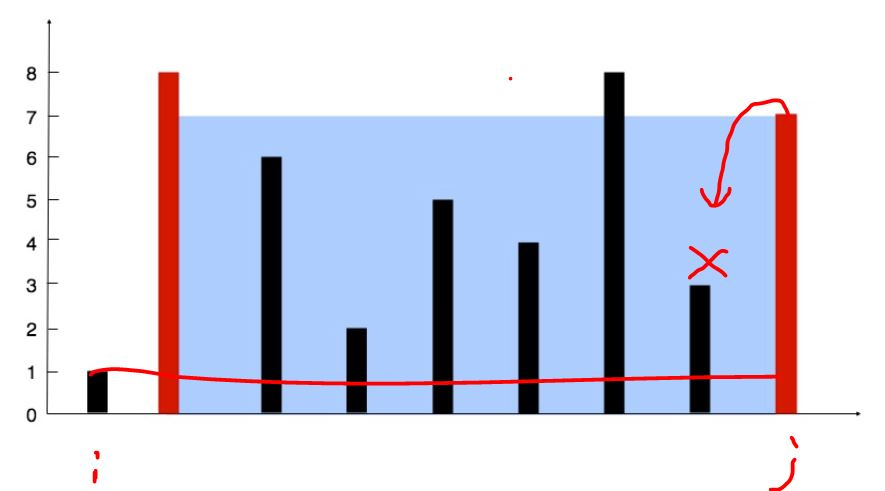

因此我们就想到了优化的方法，此时应该将 i 往中间移动，去寻找比 nums[i] 更高的柱子，来弥补宽减少导致的盛水面积的减少。通过使用左右边界指针，往中间收敛的办法，移动时移动更矮柱子的指针，将双重循环变为了一次遍历数组的操作。时间复杂度为 O(n)

```java
public int maxArea(int[] height) {
        int maxAns = 0;
        int i = 0, j = height.length - 1;
        while(i < j){
            int area = (j - i) * Math.min(height[i], height[j]);
            if(height[i] < height[j]) i++;
            else j--;

            maxAns = Math.max(maxAns, area);
        }
        return maxAns;
    }
```


### 70.爬楼梯

题目：假设你正在爬楼梯。需要 *n* 阶你才能到达楼顶。每次你可以爬 1 或 2 个台阶。你有多少种不同的方法可以爬到楼顶呢？

解题思路：一开始考虑能不能暴力解法？发现无法暴力解法，那么如何思考此类题目？一个重要思想便是--**找出重复子问题**。覃超老师说过，所有的高级算法基础语句无外乎三种：

+ if-else
+ while, for 循环
+ 递归

这种类型的题目需要从最基本的情况开始考虑：

+ 1阶楼梯：一种方法，跨一阶
+ 2阶楼梯：2中方法，1阶 + 1阶，2阶
+ 3阶楼梯：三种方法，1阶 + 1阶 + 1阶，1阶 + 2阶，2阶 + 1阶

我们来试着找一下规律，联想到数学中的归纳法，令 f(n) 表示n阶台阶的方法个数，有

+ f(1) = 1
+ f(2) =1
+ f(3) = f(1) + f(2)

为什么 **f(3) = f(1) + f(2)** 呢？可以这样考虑，当你离目标台阶只有一步时，只有两种可能跨一阶（从第二台阶到达终点），跨两阶（从第二台阶到达终点）。最后可以得到归纳方程为
$$
f(n) = f(n-1) + f(n-2)
$$
由于之前的台阶数方法已经求出来，我们可以直接使用已求过的结果来得到要求的 n 阶台阶方法

```java
public int climbStairs(int n) {
    //最基本情况，一阶台阶和二阶台阶
    //使用f1，f2不断迭代记录f(n-1), f(n-2)
	int f1 = 1;
    int f2 = 2;
    
    if(n == 1){
        return f1;
    }
    if(n == 2){
        return f2;
    }
    
    //从3阶台阶开始迭代计算到n阶台阶
    for(int i = 3; i <= n; i++){
        int tmp = f1 + f2;
        f1 = f2; 
        f2 = tmp;
    }
    
    return f2;
}
```


### 15.三数之和

**题目**：给你一个包含 n 个整数的数组 nums，判断 nums 中是否存在三个元素 a，b，c ，使得 a + b + c = 0 ？请你找出所有满足条件且不重复的三元组。

**注意**：答案中不可以包含重复的三元组

**解题思路**：在做**三数之和**之前，看**两数之和**的题目要求，发现此题可以转换为两数之和
$$
a + b = -c
$$
注意题目中的细节：

+ 返回结果中不能有重复的三元组（使用set去重）
+ 输入数组中可能有重复元素（排序使得重复元素相邻）
+ 答案不存在时返回空数组

**Case1**：首先想到最简单的就是三重暴力循环，时间复杂度为O(n^3)，超出时间限制

```java
public List<List<Integer>> threeSum(int[] nums){
    //首先对输入数组进行合法判断
    if(nums == null || nums.length < 3){
        return Collections.emptyList();
    }
    
    //先对数组进行排序，O(nlogn)
    Arrays.sort(nums);
    
    //使用集合去重
    Set<List<Integer>> result = new HashSet<List<Integer>>();
    for(int i = 0; i < nums.length - 2; i++){
        for(int j = i + 1; j < nums.length - 1; j++){
            for(int k = j + 1; k < nums.length; k++){
                if(nums[i] + nums[j] + nums[k] == 0){
                    List<Integer> tmp = Arrays.asList(nums[i], nums[j], nums[k]);
                    result.add(result);
                }
            }
        }
    }
    return new ArrayList<>(result);
}
```

**Case2**：思考如何降低时间复杂度？我们可以先对数组进行排序(O(nlog))，由于数组的有序性，在进行元素组合时，可以根据有序的特征对无效解进行直接跳过（包括sum不符合要求和重复元素避免重复计算）

**解题步骤**：k指针指向最左端元素，i, j指针分别指向 ( k+1, nums.length -1 )两端。对于固定的 nums[k]，通过双指针 i, j 的交替移动，来记录所有满足 
$$
nums[k] + nums[i] + nums[j]==0
$$
的组合情况。对于 特定的 nums[k]：

+ nums[k] > 0，跳出循环。由于数组非递减排序，不存在满足 a+b+c = 0 的组合
+ k > 0 && nums[k] ==nums[k-1]，跳过元素 nums[k]，防止出现重复组合
+  i < j 时，循环计算 **sum = nums[k] + nums[i] + nums[j]**，有
  + **sum < 0**, 指针 i 向右移动，并跳过所有重复的 nums[i]
  + **sum > 0**, 指针 j 向左移动，并跳过所有重复的 nums[j]
  + **sum==0**, 记录组合[k, i, j]。i ++ , j --, 并跳过重复元素

每次固定k元素，遍历数组元素，然后在( k+1, nums.length -1 ) 中寻找符合要求的组合，需要两重循环，时间复杂度为O(n^2)。此题重要思想：排序 + 双指针。利用数组的有序性，来减少无用的循环数

```java
public List<List<Integer>> threeSum(int[] nums) {
	//对输入合法性进行判断
    if(nums == null || nums.length < 3){
        return Collections.emptyList();
    }
    
    //对数组排序，预处理,O(nlogn)
    Arrays.sort(nums);
    List<List<Integer>> result = new ArrayList<>();
    
    for(int k = 0; k < nums.length - 2; k++){
        if(nums[k] > 0){
            break;
        }
        //跳过重复元素
        if(k > 0 && nums[k] == nums[k-1]){
            continue;
        }
        int i = k + 1;
        int j = nums.length - 1;
        while(i < j){
            int sum = nums[k] + nums[i] + nums[j];
            if(sum < 0){
                //跳过重复元素
                while(i < j && nums[i] == nums[++i]);
            }
            else if(sum > 0){
                while(i < j && nums[j] == nums[--j]);
            }
            else{
                List<Integer> tmp = Arrays.asList(nums[k], nums[i], nums[j]);
                result.add(tmp);
                while(i < j && nums[i] == nums[++i]);
                while(i < j && nums[j] == nums[--j]);
            }
        }
    }
    return result;
}
```


<font color=red>总结：注意，在处理跟数组相关的题目时，有几个思想需要谨记</font>

+ <font color = green>是否可以利用数组有序性来解题？可以预先对数数组排序进行预处理</font>
+ <font color=green>数组遍历过程中，巧妙利用双指针和元素大小关系来减少无效的遍历次数</font>


## LinkedList实战题目

### 206.反转链表

```java
//case1：遍历链表的同时反转链表,O(n)
public ListNode reverseList(ListNode head){
    //判断头节点输入
    if(head == null || head.next == null){
        return head;
    }
    
    ListNode pre = null;
    ListNode p = head;
    while(p != null){
        ListNode tmp = p.next;
        p.next = pre;
        pre = p;
        p = tmp;
    }
    return pre;
}

```

### 24.两两交换链表中的节点

**解题思路**：使用双指针进行节点指向并交换。一开始p, q分别指向 head, head.next , 然后每次进行两步跳跃，直到走到指针末尾

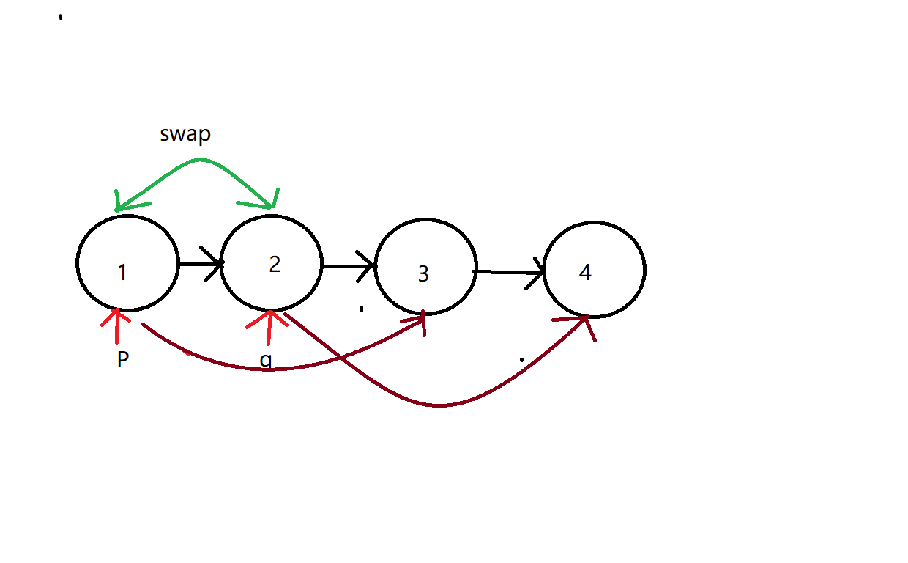

```java
//使用双指针，迭代交换
public ListNode swapPairs(ListNode head) {
    if(head == null || head.next == null){
        return head;
    }
    
    //使用dummy头节点，最后结果为dummy.next
    ListNode dummy = new ListNode(0);
    dummy.next = head;
    ListNode r = dummy;
    
    //每次两个节点交换，跳跃步数为2
    while(r.next != null && r.next.next != null){
        //指针记录要交换的两个节点，避免链表丢失
        ListNode node1 = r.next;
        ListNode node2 = r.next.next;
        
        //注意交换节点的步骤
        r.next = node2;
        node1.next = node2.next;
        node2.next = node1;
        
        //迭代
        r = r.next.next;
    }
    return dummy.head;
}
```


### 141.环形链表

```java
//case1 : 使用哈希表存储访问过的节点，当链表有环时，会访问到重复节点
//时间复杂度O(n), 空间复杂度O(n)
public boolean hasCycle (ListNode head){
    if(head == null || head.next == null){
        return false;
    }
    
    Set<ListNode> node = new HashSet<>();
    ListNode p = head;
    while(p != null){
        if(node.contains(p)){
            return true;
        }
        node.add(p);
        p = p.next;
    }
    return false;
}

//case2 : 不使用哈希表存储访问节点，使用双指针思路
//快慢指针思想：fast每次走两步，slow每次走一步，当链表有环时，两个指针一定会相遇
//时间复杂度O(n), 空间复杂度O(1)
public boolean hasCycle (ListNode head){
    if(head == null || head.next == null){
        return false;
    }
    ListNode fast = head;
    ListNode slow = head;
    while(fast != null && fast.next != null){
        fast = fast.next.next;
        slow = slow.next;
        if(fast == slow){
            return true;
        }
    }
    return false;
}
```


### 142.环形链表2

```java
//case1 : 使用哈希表存储访问过的节点，当遇到相同节点时，该节点即为入环点
public ListNode detectCycle(ListNode head){
    if(head == null || head.next == null){
        return null;
    }
    Set<ListNode> node = new HashSet<>();
    ListNode p = head;
    while(p != null){
        if(node.contains(p)){
            return p;
        }
        node.add(p);
        p = p.next;
        
    }
    return null;
}
```

数学公式推导如何计算入环节点

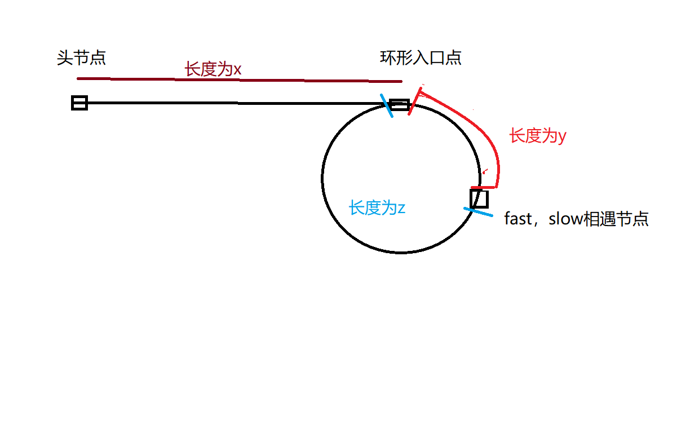

如上图所示，当快慢指针相遇时，slow走过节点数：
$$
 slow = x+y
$$
fast走过节点数，其中n为fast在环内走了n圈才遇到slow指针，y+z为环内节点个数
$$
fast = x + y +n*(y+z)
$$
由于fast，slow的行走速度关系，可得
$$
2*(x+y)=x+y+n*(y+z)
$$

$$
x= (n-1)(y+z)+z
$$

取特殊情况 **n=1**，可得 **x=z**，即头节点至入环点距离 = 相遇处至入环点距离。所以我们当求出链表存在环时，分别使用指针 **idx1, idx2** 指向头节点和相遇节点，两个节点迭代步数都为1，直到他们相遇，则相遇点即为入环点

```java
public ListNode detectCycle(ListNode head){
	if(head == null || head.next == null){
        return null;
    }
    
    ListNode fast = head;
    ListNode slow = head;
    
    //找相遇点
    while(fast != null && fast.next != null){
        fast = fast.next.next;
        slow = slow.next;
        if(fast == slow){
            break;
        }
    }
    
    //判断是否有环
    if(fast == null || fast.next == null){
        return null;
    }
    
    //头节点和相遇节点同时迭代
    ListNode p1 = head;
    ListNode p2 = fast;
    
    while(p1 != p2){
        p1 = p1.next;
        p2 = p2.next;
    }
    return p1;
}
```


### 25.k个一组翻转链表

在链表中，我们需要对k个一组的链表进行翻转。联想到栈先进后出的特性，使用栈作为辅助结构来对k个一组的链表进行翻转。同时注意当最后一组的节点不满足k时，不需要进行翻转，需要进行特殊判断

```java
public ListNode reverseKGroup(ListNode head, int k){
    if(head == null){
        return head;
    }
    
    //使用栈作为辅助结构存储k个一组节点，进行翻转
    Stack<ListNode> node = new Stack<>();
    
    ListNode dummy = new ListNode(0);
    //使用尾插法建立新链表
    ListNode r = dummy;
    
    //保存当前k个一组节点后的链表，当节点总数不为k整数倍时，不反转链表
    ListNode tmp = head;
    
    //入栈节点计数器
    int cnt;
    
    while(true){
        cnt = 0;
        while(head != null && cnt < k){
            node.push(head);
            head = head.next;
            cnt++;
        }
        
        //判断是否满足k个一组
        if(cnt != k){
            r.next = tmp;
            break;
        }
        
        while(!node.empty()){
            ListNode q = node.pop();
            r.next = q;
            r = r.next;
         
        }
        tmp = head;
    }
    return dummy.next;
    
}
```

原地翻转链表

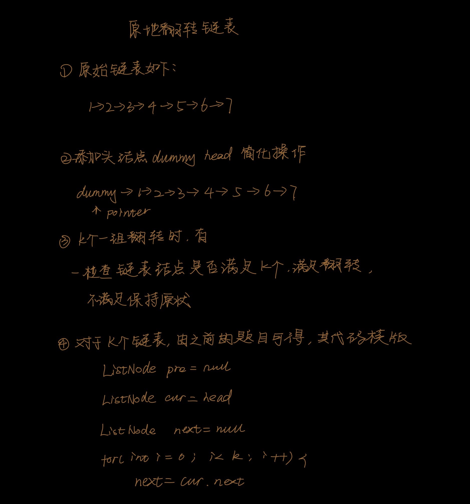

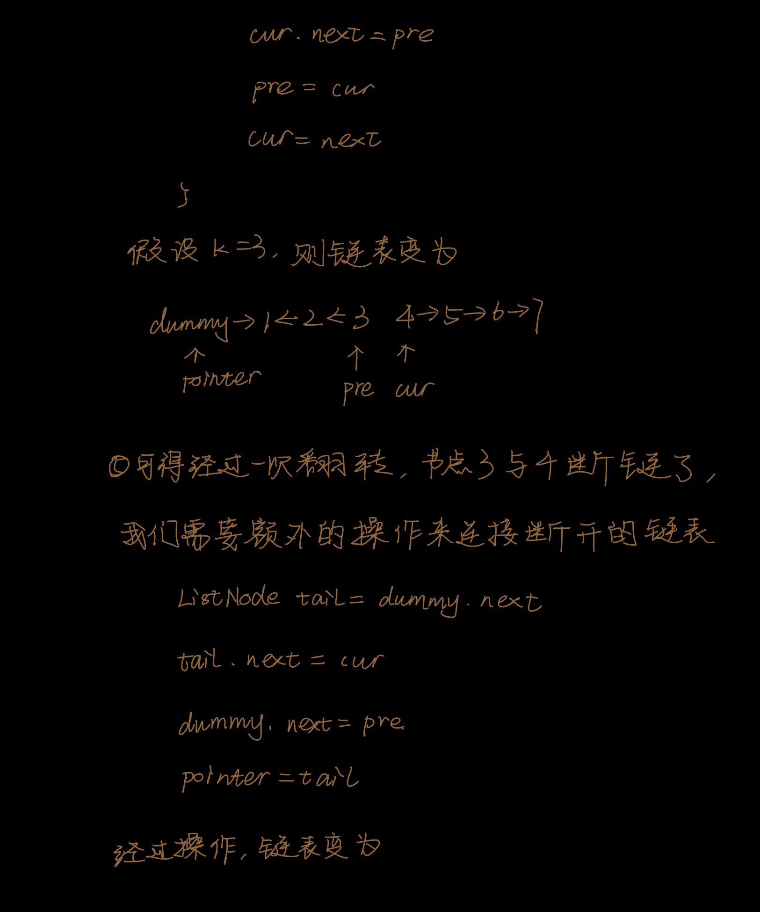

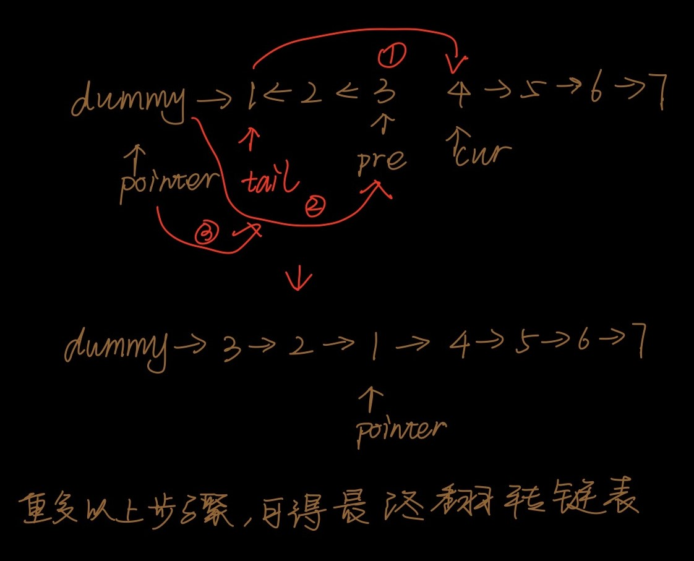

```java
public ListNode reverseKGroup (ListNode head, int k){
	if(head == null){
		return head;
	}
	
	//dummy head
	ListNode dummy = new ListNode(0);
	dummy.next = head;
	//设定p尾指针，用于串联链表
	ListNode p = dummy;
	
	while(p != null){
		//计数是否满足k节点
		ListNode node = p;
		for(int i = 0; i < k && node != null; i++){
			node = node.next;
		}
        
        //检查
        if(node == null) break;
        
        //翻转链表
        ListNode pre = null;
        ListNode cur = p.next;
        ListNode next = null;
        for(int i = 0; i < k; i++){
            next = cur.next;
            cur.next = pre;
            pre = cur;
            cur = next;
        }
        //额外操作将断链连接
        ListNode tail = p.next;
        tail.next = cur;
        p.next = pre;
        p = tail;
	}
    return dummy.next;
}
```

<font color=red>链表总结</font>

+ <font color=green>操作链表时需要注意next指针的变换，不要弄丢了链表</font>

+ <font color=green>链表类型的题目解题思想通常为双指针和快慢指针，用两个指针根据题目条件进行链表的遍历，在遍历过程中同时进行相应的操作</font>

+ <font color=green>解决链表题目时需要动手画图，不要空想，容易出错</font>

  

## 队列，栈

### 1.分析Queue, PriorityQueue的源码

```java
//Queue的源码分析
//Queue为一个接口定义：interface
public interface Queue<E> extends Collection<E>{
    
    //向队列尾部加入E，加入成功返回true，队列满时抛出IllegalStateException异常
	boolean add(E e);
    
    //向队列尾部加入元素E，加入成功返回true，队列满时返回false
    boolean offer(E e);
    
    //从队列头部移除元素，移除成功返回头部元素E；队列空时抛出异常NoSuchElementException
	E remove();
    
    //从队列头部移除元素，移除成功返回头部元素E；队列空时返回null
    E poll();
    
    //得到队列头部元素，但不移除，当队列空时抛出异常NoSuchElementException
    E element();
    
    //得到队列头部元素，但不移除，队列空时返回null
    E peek();
}
```


**优先队列总结**

+ 底层实现：完全二叉树数组+堆调整函数（大顶堆）
+ 对初始输入序列进行一次堆调整（下沉操作），使得每个根节点关键字都比其子树关键字大；对所有非叶子节点进行调整。从第一个非叶子节点开始调整 (index = size / 2)
+ 当加入元素时，将元素加入队列末尾，需要对新加入元素进行上浮操作（上浮至正确位置）
+ 当取队头元素时，默认取queue[0]元素，此元素为关键字最大元素
+ 当删除元素时，弹出队头元素，将末尾元素放置对头，然后对队头元素进行下沉操作（下沉至正确位置）
+ 时间复杂度：可以看到，加入和删除元素需要对堆进行调整，O(logn)；取头元素为O(1)

```java
//PriotiryQueue源码分析
/*
1.底层实现：基于平衡二叉堆实现，元素排序基于自然排序方式，或者提供Comparator比较器类
2.各种操作时间复杂度：
	- 进队出队O(logn)(每次进入和删除元素需要调整对堆进行调整)
	- 移除和查找特定元素O(n)，需要遍历所有队列中的元素
	- 取对头元素和队列大小O(1)
*/

public class PriorityQueue<E> extends AbstractQueue<E>
    implements java.io.Serializable{
    
    //版本序列号
    private static final long serialVersionUID = -7720805057305804111L;

    //默认队列初始容量
    private static final int DEFAULT_INITIAL_CAPACITY = 11;
    
    //存放元素数组
    transient Object[] queue;
    
    //队列中元素个数
    private int size = 0;
    
    //比较器
    private final Comparator<? super E> comparator;
    
    //队列结构改变次数
    transient int modCount = 0; 
    
   	//主要函数分析
    
    //对初始序列进行堆调整的函数
    private void heapify(){
        
        /*
        1.元素放置方法为完全二叉树，从最后一个非叶子节点开始进行下沉调整
        2.最后一个非叶子节点下标为size/2 : 等价于size>>>1
        3.下沉调整：当根节点比其孩子节点小时，不满足大顶堆定义，需要将元素下沉到正确位置
        */
        for(int i = (size>>>1) - 1; i >= 0; i--)
            siftDown(i, (E) queue[i]);
    }
    
    //从下标k开始，比较k与其子节点的大小进行下沉操作
    private void siftDown(int k, E x){
        //提供了比较器对象，使用比较器进行下沉操作
        if(comparator != null)
            siftDownUsingComparator(k, x);
        //未提供比较器，采用自然排序方式
        else
            siftDownComparable(k, x);
    }
    
    //对下标为k的节点E与其子树进行调整，使其满足大顶堆性质
    //大顶堆：根节点元素最大
    private void siftDownComparable(int k, E x){}
    private void siftDownUsingComparator(int k, E x){
        //half：最后一个非叶子节点
        int half = size >>> 1;
        
        //迭代调整，一直到调整到最后一个非叶子节点结束调整
        while (k < half) {
            //child:E的左孩子
            int child = (k << 1) + 1;
            Object c = queue[child];
            
            //E的右孩子
            int right = child + 1;
            
            //在左孩子和右孩子中找关键字最大的孩子
            if (right < size &&
                comparator.compare((E) c, (E) queue[right]) > 0)
                c = queue[child = right];
            
            //当根节点不再比子节点小时，结束调整
            if (comparator.compare(x, (E) c) <= 0)
                break;
            //交换E和其最大孩子节点位置
            queue[k] = c;
            //E继续与其孩子节点的子树节点继续比较，最终下沉到正确位置
            k = child;
        }
        queue[k] = x;
    }
    
    //对下标为K的元素进行上浮调整
    //上浮调整：当该元素大于根节点时需要进行上浮操作
    private siftUp(int k, E x){
        if (comparator != null)
            siftUpUsingComparator(k, x);
        else
            siftUpComparable(k, x);
    }
    
    private void siftUpComparable(int k, E x){}
    private void siftUpUsingComparator(int k, E x){
        //上浮终止条件：k为第二个元素时，其父元素为queue[0]
         while (k > 0) {
             //父节点元素:(k-1)/2
            int parent = (k - 1) >>> 1;
            Object e = queue[parent];
             //若当前元素小于父节点元素，停止上浮操作
            if (comparator.compare(x, (E) e) >= 0)
                break;
             //交换父节点和当前元素位置，当前元素继续上浮
            queue[k] = e;
            k = parent;
        }
        queue[k] = x;
    }
    
    //加入元素
    public boolean offer(E e) {
        if (e == null)
            throw new NullPointerException();
        modCount++;
        int i = size;
        //队列容量不够，增加容量
        if (i >= queue.length)
            grow(i + 1);
        size = i + 1;
        //队列为空，直接加入元素为头元素
        if (i == 0)
            queue[0] = e;
        //否则放入数组末尾，并进行上浮操作
        else
            siftUp(i, e);
        return true;
    }
    
    //删除元素
    public E poll() {
        if (size == 0)
            return null;
        int s = --size;
        modCount++;
        //取队头元素
        E result = (E) queue[0];
        //将末尾元素换至队头
        E x = (E) queue[s];
        queue[s] = null;
        //进行下沉操作
        if (s != 0)
            siftDown(0, x);
        return result;
    }
}
```


### 20.有效的括号

**解题思路**：使用剥洋葱的思路，一层一层的去掉已经匹配的括号。使用栈先进后出的特性，完成括号的匹配。采用逆向思维，遇到左括号，将其相应右括号入栈，否则将当前元素和栈顶元素比较，相同则完成一次括号匹配。最终遍历完字符串后，若栈空则字符串有效，否则无效

```java
public boolean isValid(String s){
    Stack<Character> st = new Stack<>();
    
    //遍历字符串
    for( char c : s.toCharArray() ){
        if (c == '(')
            st.push(')');
        else if (c == '[')
            st.push(']');
        else if (c == '{')
            st.push('}');
        
        //遇到右括号，比较当前元素和栈顶元素
        else {
            if (st.empty() || st.pop() != c)
                return false;
        }
    }
    
    return st.empty();
}
```


### 155.最小栈

**解题思路**：为了在O(1)的时间内拿到栈中的最小元素，同时保持元素先进后出的特性，我们维护另外一个最小栈，对每个元素维护一个其对应的最小值。该题需要两个栈，一个数据栈存储所有元素，一个最小栈，存储每个元素对应的最小元素

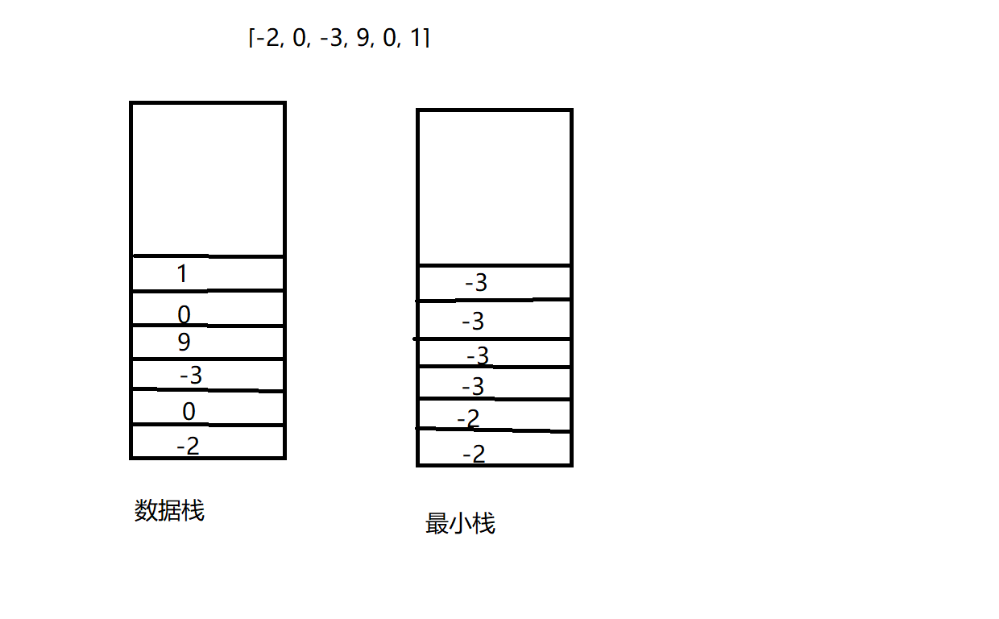

如图，在最小栈中维护每个元素对应的最小值。更新最小栈时，比较当前元素和最小栈顶元素。注意为了保证数据的先进先出特性，弹出操作时需要对数据栈和最小栈同时进行弹出，保证元素的对应关系

```java
class MinStack {

    /** initialize your data structure here. */
    //需要维护当前的最小元素且满足先进后出的栈特性
    //使用两个栈，一个存放所有元素，一个存放当前栈中的最小元素
    private Stack<Integer> st = new Stack<Integer> ();
    private Stack<Integer> minst = new Stack<Integer> ();

    public MinStack() {

    }
    
    public void push(int x) {
        //st将元素入栈
        st.push(x);

        //同时维护最小栈信息
        if (minst.empty())
            minst.push(x);
        else{
            if (minst.peek() < x)
                minst.push(minst.peek());
            else 
                minst.push(x);
        }
    }
    
    public void pop() {
        //同时弹出最小栈和数据栈的元素，保持两个栈同步
        st.pop();
        minst.pop();
    }
    
    public int top() {
        return st.peek();
    }
    
    public int getMin() {
        return minst.peek();
    }
}
```


### 84.柱状图中最大的矩形

**题目**：给定 *n* 个非负整数，用来表示柱状图中各个柱子的高度。每个柱子彼此相邻，且宽度为 1 。求在该柱状图中，能够勾勒出来的矩形的最大面积

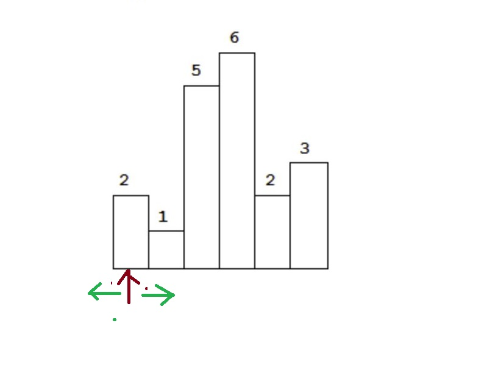

**解题思路**

**case1** : 对于第一根柱子，思考以它为高的最大柱子面积是多少？其本质是**找出以其下标 i 为中心点，向左和向右可以扩展的最大宽度**。由此可以想到第一种解法，枚举每根柱子的高度，依次找其左边最远点和右边最远点，最后求其面积。时间复杂度为O(n^2)，空间复杂度O(1)

```java
public int largestRectangleArea(int[] heights) {
    //枚举柱子高度，找其最远可以扩展的高度
    int maxAns = 0;
    for(int i = 0; i < heights.length; i++){
        
        //找其左边界
        int left = i - 1;
        while(left >= 0 && heights[left] >= heights[i]) left--;
        
        //找其右边界
        int right = i + 1;
        while(right <= heights.length -1 && heights[right] >= heights[i]) right++;
        
        //计算面积
        int area = (right - left -1) * heights[i];
        maxAns = Math.max(maxAns, area);
    }
    return maxAns;
}
```


**case2** : 思考 case1 中的枚举过程，我们发现在枚举每一根柱子的高度时，找其左右边界过程中，存在某些左边的柱子和右边的柱子是被重复遍历的。我们是否可以使用辅助数据结构来记录这些已经遍历过的柱子，然后再遍历新柱子的高度时直接操作之前已经得到的信息，从而减少循环次数，降低时间复杂度？

我们发现柱子最远可以扩展的左右边界是遇到比自己矮的柱子时停止，那么在遍历柱子时，保持柱子高度的升序，当遇到矮柱子时，就需要立马计算以上一根柱子高度为高可得到的最大面积。对于之前的柱子，我们还不知道其最远可扩展右边界，因此不需要计算最大面积。**根据面积计算的先进后计算的性质，使用辅助数据结构栈，并维持栈中元素的非递减性**。此解法只需要遍历一次柱子高度，每个柱子的下标都只会进出栈一次，时间复杂度为O(n)

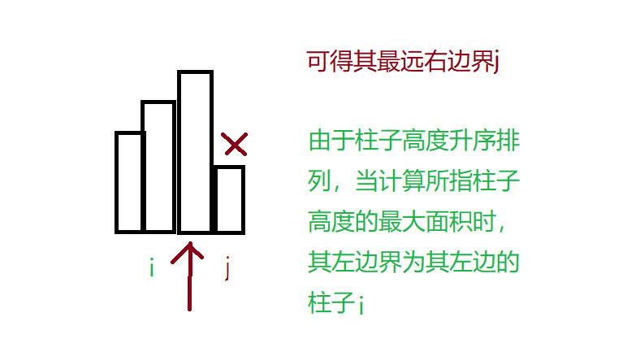

```java
public int largestRectangleArea(int[] heights) {
    int maxAns = 0;
    
    //保证栈中存放遍历过的柱子的高度非递减性质
    //栈中存放柱子下边，用于计算最大可扩展宽度
    Stack<Integer> idx = new Stack<Integer>();
    
    int i = 0;
    while(i < heights.length){
        //若当前柱子i高度小于栈顶柱子高度，计算栈顶柱子高度，注意该步骤放在循环中，因为可能有多根柱子需要计算面积
        while (!idx.empty() && heights[idx.peek()] > heights[i]){
            //栈顶柱子下标
            int top = idx.pop();
            //右边界
            int width = i;
            
            //当栈顶柱子存在左边界时，计算最大宽度，需要考虑第一根柱子的特殊情况
            if (!idx.empty())
                width = width - idx.peek() -1;
            int area = width * heights[top];
            maxAns = Math.max(maxAns, area);
        }
        
        //i柱子进栈，继续遍历下一根柱子
        idx.push(i);
        i++;
    }
    
    //计算栈中剩余柱子面积
    while (!idx.empty()){
        int top = idx.pop();
        
        //注意剩余柱子的右边界
        int width = heights.length;
        if (!idx.empty())
            width = width - idx.peek() -1;
        int area = width * heights[top];
        maxAns = Math.max(maxAns, area);
    }
    return maxAns;
}
```

### 

### 239.滑动窗口最大值

**题目** ：给定一个数组 nums，有一个大小为 k 的滑动窗口从数组的最左侧移动到数组的最右侧。你只可以看到在滑动窗口内的 k 个数字。滑动窗口每次只向右移动一位。返回滑动窗口中的最大值。

**示例** ：

```
输入: nums = [1,3,-1,-3,5,3,6,7], 和 k = 3
输出: [3,3,5,5,6,7] 
解释: 

  滑动窗口的位置                最大值
---------------               -----
[1  3  -1] -3  5  3  6  7       3
 1 [3  -1  -3] 5  3  6  7       3
 1  3 [-1  -3  5] 3  6  7       5
 1  3  -1 [-3  5  3] 6  7       5
 1  3  -1  -3 [5  3  6] 7       6
 1  3  -1  -3  5 [3  6  7]      7
```

**解题思路**

**case1** : 直观思路，在每一个滑动窗口中遍历元素寻找窗口内的最大值。n个元素的数组共有 **n-k+1 **个窗口，每个窗口需要遍历元素 **k** 个，因此时间复杂度为 **O(k*n)** ，超出了时间限制

```java
public int[] maxSlidingWindow(int[] nums, int k){
    int[] ans = new int [nums.length - k +1];
    for(int i = 0;i <= nums.length - k; i++){
        int maxInt = Integer.MIN_VALUE;
        for(int j = i; j < i + k; j++){
            maxInt = Math.max(maxInt, nums[j]);
        }
        ans[i] = maxInt;
    }
    return ans;
}
```

**case2** : 仔细想想，在枚举每一个窗口的最大元素时，有许多元素是重复遍历的。我们是否可以使用额外的数据结构来保存已经遍历过的元素的信息，使得每个元素只需要遍历一次就可以得到每个窗口的最大值，从而降低时间复杂度？

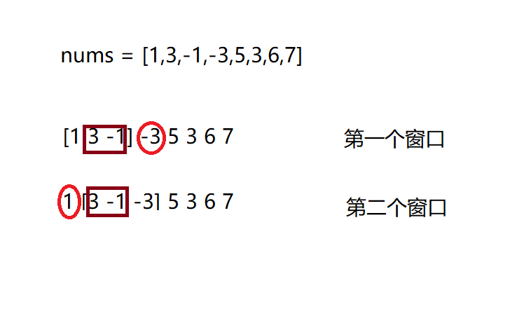

从图中我们可以看到，第一个窗口滑动到第二个窗口时，方框内的元素[3, -1]是已经遍历过的元素，而元素1出窗，元素-3进窗。那么我们在第一个窗口求出的最大值（已知是3）只需要和新进入的新元素 **-3** 比较即可，而不需要重新遍历第二个窗口的所有元素找最大值。

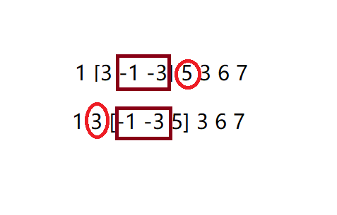

注意到一个情况，当窗口滑动时，如果刚好把上一个窗口内的最大值滑出去了，我们又如何知道新窗口内的次大值是多少呢？

我们观察第一个窗口中，其最大值为3，当滑动第一个窗口时将1移出是不会影响第二个窗口的最大值的，然后从第二个窗口继续移动时发现3被移出了，而-1成为了次大值，所以说明我们是需要保留-1的值的。联想上一题**求最大柱子面积的题目**，我们是否可以使用单调栈中的**元素单调性**来试着解决这个问题？同时由于滑动窗口的性质，我们需要先进先出的特性，于是引入了新的概念--**单调双端队列**。

我们需要维护队列中元素的递减性（保证最大值被移出时，次大值还在队列中）。在遍历窗口元素时，如果当前元素比队列尾部元素大，那么就找到了窗口内的最大元素，可以将队列中比其小的元素全部弹出（在移动窗口过程中，因为先进先出特性，比其小的元素会先移出窗口，最大值仍然保留在队列中）。

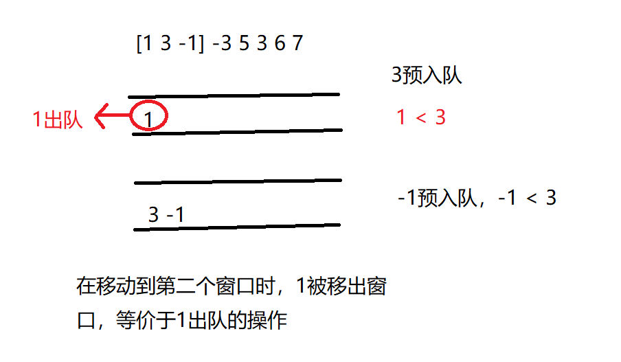

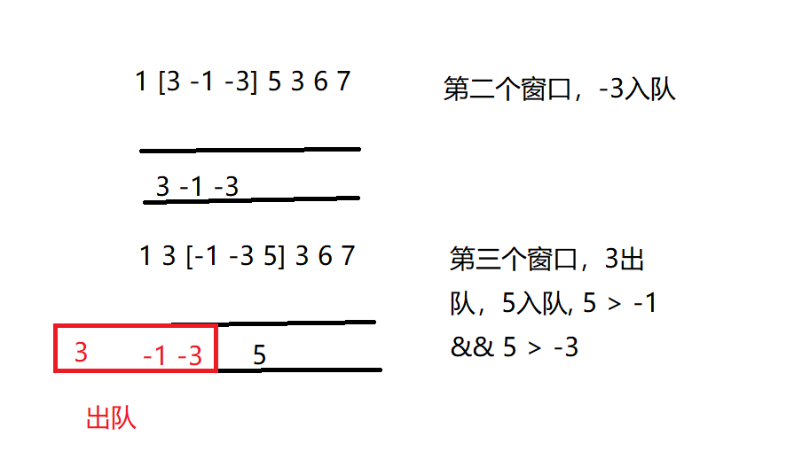

```java
public int[] maxSlidingWindow(int[] nums, int k) {
    int n = nums.length;
    int[] ans = new int[n - k + 1];
    int cnt = 0;
    //双端队列，用于存放元素下标
    LinkedList<Integer> queue = new LinkedList<>();
    
    for(int i = 0; i < n; i++){
        //保证队列的单调递减性
        while(!queue.isEmpty() && nums[queue.peekLast()] < nums[i])
            queue.pollLast();
        
        //加入该元素
        queue.offerFirst(i);
        
        //滑动窗口，将不在窗口范围内的元素移除
        if(queue.peekFirst() < i - k + 1)
            queue.pollFirst();
        
        //记录窗口最大值
        if(i >= k - 1)
            ans[cnt++] = nums[queue.peekFirst()];
    }
    return ans;
}
```


### 641.设计循环双端队列

```java
class MyCircularDeque {

    /** Initialize your data structure here. Set the size of the deque to be k. */
    //设计双端队列：数组还是链表？双向链表实现双端队列
    static class Node{
        int value;
        //头尾指针
        Node next;
        Node prev;
        public Node(){}
        public Node(int value){
            this.value = value;
            next = null;
            prev = null;
        }
    }
    //头指针，尾指针，不包含数据
    private Node head;
    private Node tail;

    //节点个数
    private int size;

    //队列容量
    private int  capacity;
    
    public MyCircularDeque(int k) {
        capacity = k;
        size = 0;
        
        head = new Node();
        tail = new Node();
        
        head.next = tail;
        tail.prev = head;
    }
    
    /** Adds an item at the front of Deque. Return true if the operation is successful. */
    public boolean insertFront(int value) {
        //在队列头部加入元素
        //队列是否满
        if(isFull())
            return false;
        
        Node newNode = new Node(value);
        newNode.next = head.next;
        head.next.prev = newNode;
        head.next = newNode;
        newNode.prev = head;

        size++;
        return true;
    }
    
    /** Adds an item at the rear of Deque. Return true if the operation is successful. */
    public boolean insertLast(int value) {
        if(isFull())
            return false;
        
        Node newNode = new Node(value);
        newNode.prev = tail.prev;
        tail.prev.next = newNode;
        tail.prev = newNode;
        newNode.next = tail;

        size++;
        return true;
    }
    
    /** Deletes an item from the front of Deque. Return true if the operation is successful. */
    public boolean deleteFront() {
        if(isEmpty())
            return false;
        
        //删除队列头部信息
        Node res = head.next;
        head.next = res.next;
        res.next.prev = head;

        size--;
        return true;
        
    }
    
    /** Deletes an item from the rear of Deque. Return true if the operation is successful. */
    public boolean deleteLast() {
        if(isEmpty())
            return false;

        Node res = tail.prev;
        tail.prev = res.prev;
        res.prev.next = tail;

        size--;
        return true;
    }
    
    /** Get the front item from the deque. */
    public int getFront() {
        if(isEmpty())
            return -1;

        return head.next.value;
    }
    
    /** Get the last item from the deque. */
    public int getRear() {
        if(isEmpty())
            return -1;
        
        return tail.prev.value;
    }
    
    /** Checks whether the circular deque is empty or not. */
    public boolean isEmpty() {
        return size == 0;
    }
    
    /** Checks whether the circular deque is full or not. */
    public boolean isFull() {
        return size == capacity;
    }
}
```


### 42.接雨水


### 26.删除排序数组中的重复项

**题目**：给定一个排序数组，你需要在 原地 删除重复出现的元素，使得每个元素只出现一次，返回移除后数组的新长度。不要使用额外的数组空间，你必须在 原地 修改输入数组 并在使用 O(1) 额外空间的条件下完成。

**解题思路**：由题意，输入数组已经排好序，那么相同的元素处于相邻的位置，联想到 **移动零** 的题目，使用双指针进行重复元素的删除

```java
public int removeDuplicates(int[] nums) {
    if (nums == null)
        return 0;
    if(nums.length == 1)
        return 1;
    
    //记录非重复值下标
    int j = 0;
    for(int i = 0; i < nums.length; i++){
        //在重复元素中只选择第一个元素，其余跳过
        if (i > 0 && nums[i] == nums[i - 1])
            continue;
        //记录元素
        nums[j++] = nums[i];
    }
    return j;
}
```


###  189.旋转数组

**题目**：给定一个数组，将数组中的元素向右移动 *k* 个位置，其中 *k* 是非负数。

**示例**：

```
输入: [1,2,3,4,5,6,7] 和 k = 3
输出: [5,6,7,1,2,3,4]
解释:
向右旋转 1 步: [7,1,2,3,4,5,6]
向右旋转 2 步: [6,7,1,2,3,4,5]
向右旋转 3 步: [5,6,7,1,2,3,4]
```

**解题思路**

```java
//1.暴力解法，每次将数组元素向右移动1个位置，移动k次
//时间复杂度O(k*n),每次移动都需要移动n-1个元素，空间复杂度O(1)
public void rotate(int[] nums, int k) {
    int n = nums.length;
    for(int i = 0; i < k; i++){
        int temp = nums[n - 1];
        for(int j = n - 2; j >= 0; j--){
            nums[j + 1] = nums[j];
        }
        nums[0] = temp;
    }
    return ;
}
```

```java
//2.使用额外数组，每个元素的新下标为 (i + k) % len;
//时间复杂度O(n)，空间复杂度O(n)
public void rotate(int[] nums, int k) {
    int n = nums.length;
    int[] temp = new int[n];
    
    for(int i = 0; i < n; i++){
        int idx = (i + k) % n;
        temp[idx] = nums[i];
    }
    for(int i = 0; i < n; i++){
        nums[i] = temp[i];
    }
    return ;
}
```

```java
//3.使用反转，重点记住该思路
/*
当我们旋转数组k次时，k%n个尾部元素会被移动到头部，剩余的元素会被向后移动
1.首先将所有元素反转
2.反转前k个元素
3.再反转后面n-k个元素
时间复杂度O(n)，空间复杂度O(1)
*/

public void reverse(int[] nums, int start, int end) {
    for(int i = start, j = end; i < j; i++, j--){
        int temp = nums[i];
        nums[i] = nums[j];
        nums[j] = temp;
    }
    return ;
}

public void rotate(int[] nums, int k) {
    int n = nums.length;
    reverse(nums, 0, n - 1);
    
    k %= n;
    reverse(nums, 0, k - 1);
    reverse(nums, k, n - 1);
}
```


### 21.合并两个有序链表

**题目**：将两个升序链表合并为一个新的 **升序** 链表并返回。新链表是通过拼接给定的两个链表的所有节点组成的。

```java
//p1, p2分别指向l1, l2，遍历过程中选择较小元素连到新链表的尾部
//时间复杂度O(n+m)
public ListNode mergeTwoLists(ListNode l1, ListNode l2) {
    ListNode dummy = new ListNode(0);
    ListNode p = dummy;
    
    while(l1 != null && l2 != null){
        if(l1.val < l2.val){
            p.next = l1;
            l1 = l1.next;
        }
        else{
            p.next = l2;
            l2 = l2.next;
        }
        p = p.next;
    }
    if(l1 != null)
        p.next = l1;
    
    if(l2 != null)
        p.next = l2;
    
    return dummy.next;
}
```


### 88.合并两个有序数组

```java
//1.使用辅助数组存储nums1的值
//时间复杂度O(n+m), 空间复杂度O(m)
public void merge(int[] nums1, int m, int[] nums2, int n) {
    int[] temp = new int[m];
    for(int i = 0; i < m; i++)
        temp[i] = nums1[i];
    
    //temp, nums2的指针
    int p1 = 0, p2 = 0;
    for(int i = 0; i < m + n; i++){
        if(p1 >= m)
            nums1[i] = nums2[p2++];
        else if(p2 >= n)
            nums1[i] = temp1[p1++];
        else{
            if(temp[p1] < nums2[p2])
                nums1[i] = temp[p1++];
            else
                nums1[i] = nums2[p2++];
        }
    }
    return ;
}
```

```java
//2.不使用辅助空间
/*
若不使用辅助空间，分别从nums1和nums2首元素开始找较小元素，会造成nums1中元素的丢失。使用逆向思维，分别从两个数组的尾元素开始找最大元素，放置在nums1数组正确位置中
*/

//时间复杂度O(m+n), 空间复杂度O(1)
public void merge(int[] nums1, int m, int[] nums2, int n) {
	//尾元素指针
    int p = m + n - 1;
    
    //nums1，nums2的指针
    int p1 = m - 1;
    int p2 = n - 1;
    while (p1 >= 0 && p2 >= 0){
        if (nums[p1] < nums[p2])
            nums1[p--] = nums2[p2--];
        else
            nums1[p--] = nums1[p1--];
    }
    
    //将剩余元素移入结果数组,只需要对nums2操作
    //若剩余nums1数组元素，则其位置已经正确排序
    while (p2 >= 0)
        nums1[p--] = nums2[p2--];
    
    return ;
}
```


### 1.两数之和

**case1** : 暴力解法。元素不可以使用两次，则枚举每一个元素nums[i]，在[i+1, len - 1] 中找 **nums[i] + nums[j] == target** 的解。时间复杂度O(n^2)

```java
public int[] twoSum(int[] nums, int target) {
        int[] ans = new int[2];
        for(int i = 0; i < nums.length - 1; i++){
            for(int j = i + 1; j < nums.length; j++){
                if(nums[i] + nums[j] == target){
                    ans[0] = i;
                    ans[1] = j;
                    break;
                }
            }
        }
        return ans;
    }
```

**case2** : 使用哈希表存储元素和下标的对应关系，然后枚举nums[i]的过程中，我们不需要循环遍历之后的元素，而是使用哈希直接查询表中是否存在 **target - nums[i]** 的元素。时间复杂度为O(n)。注意该题建立在默认没有重复元素的情况下，一个target之后对应一个组合答案。时间复杂度O(n)，空间复杂度O(n)

```java
public int[] twoSum(int[] nums, int target) {
    int[] ans = new int[2];
    Map<Integer, Integer> mp = new HashMap<Integer, Integer>();
    for(int i = 0; i < nums.length; i++){
        mp.pus(nums[i], i);
    }
    
    for(int i = 0; i < nums.length; i++){
        int tmp = target - nums[i];
        if(mp.containsKey(tmp) && mp.get(tmp) != i){
            ans[0] = i;
            ans[1] = mp.get(tmp);
            break;
        }
    }
    return ans;
}
```


### 66.加一

```java
//使用额外数组存储结果
public int[] plusOne(int[] digits) {
	int n = digits.length;
    int[] ans = new int[n];
    int cnt = n;
    int carry = 0;
    for(int i = n - 1; i >= 0 ; i--){
        int res = digits[i] + carry;
        if(i == n - 1)
            res += 1;
        carry = res / 10;
        digits[i] = res % 10;
        ans[cnt--] = res % 10;
    }
    if(carry != 0)
    {
        ans[0] = carry;
        return ans;
    }
    return digits;
}
```

```java
//更优解
/*
通过分析可得，每个位置存储值为个数，只有两种可能
1.9
2.其他数字
则在进行加法过程，产生进位只可能是由9变成10，且进位为1
*/
public int[] plusOne(int[] digits) {
	int n = digits.length;
    for(int i = n - 1; i >= 0; i--){
        //对每一位加1，若当前存在进位，继续进位
        //否则停止循环
        digits[i]++;
        digits[i] = digits[i] % 10;
        //若余数不为0，则说明没有进位，直接返回digits数组
        if(digits[i] != 0)
        	return digits;
    }
    //否则每一位都有进位，注意最后高位的进位
    digits = new int[n + 1];
    digits[0] = 1;
    return digits;
}
```


### 42.接雨水

**题目**：给定 *n* 个非负整数表示每个宽度为 1 的柱子的高度图，计算按此排列的柱子，下雨之后能接多少雨水。

 **示例**


```
输入：height = [0,1,0,2,1,0,1,3,2,1,2,1]
输出：6
```

**解题思路**

**case1**：思考最基本的情况，每个位置能接的最多雨水是多少？根据短板效应，每个位置最多接雨水 = min ( 最边最高柱子，右边最高柱子) - 柱子 i 的高度。因此可以枚举每一根柱子，暴力求解每个位置可接的雨水数。时间复杂度O(n)，空间复杂度O(1)

```java
public int trap(int[] height) {
    int ans = 0;
    int n = height.length;
    if(n == 0)
        return ans;
    
    for(int i = 0; i < n; i++){
        //找左边最高柱子
        int left = i;
        for(int j = i - 1; j >= 0; j--){
            if(height[left] < height[j])
                left = j;
        }
        
        //找右边最高柱子
        int right = i;
        for(int j = i + 1; j < n; j++){
            if(height[right] < height[j])
                right = j;
        }
        
        ans += Math.abs(height[i] - Math.min(height[left], height[right]));
    }
    
    return ans;
}
```

**case2**：我们可以看到，枚举每一根柱子的过程中，有些柱子是重复遍历的。我们采用 **空间换时间** 的思维，看是否可以把每个位置的左边最大值和右边最大值提前记录下来，遍历时直接使用即可，从而减少遍历次数，降低时间复杂度。

```java
//使用额外数组，记录每个位置的左边和右边最大值
//时间复杂度O(n)，空间复杂度O(n)
public int trap(int[] height) {
    int ans = 0;
    int n = height.length;
    
    if(n == 0)
        return ans;
    
    //左边右边最大值初始化为自身
    int[] left = Arrays.copyOf(height, n);
    int[] right = Arrays.copyOf(height, n);
    
    //从左向右遍历求左边最大值
    for(int i = 1; i < n; i++){
        left[i] = Math.max(left[i - 1], left[i]);
    }
    
    for(int i = n - 2; i >= 0; i--){
        right[i] = Math.max(right[i + 1], right[i]);
    }
    
    for(int i = 0; i < n; i++){
        ans += Math.abs(height[i], Math.min(left[i], right[i]));
    }
    
    return ans;
}
```

**case3**：**栈的应用**。联想到之前的求最大矩形面积的题目，我们发现每个位置能接雨水的高度是由其左右边界最大柱子高度决定的。即当遇到更高的柱子时就需要计算当前位置可接雨水量，所以我们需要维护栈中元素的**单调非递增性**，若当前元素的柱子高度>栈顶柱子高度，则栈顶柱子位置可以计算雨水量，而由于元素的单调非递增性，**栈顶柱子的前一根柱子高度 > 栈顶柱子高度 < 当前柱子高度**，我们可以计算栈顶柱子所接雨水量。

```java
//时间复杂度O(n)，所有元素进栈出栈一次
//空间复杂度O(n)
public int trap(int[] height){
    int ans = 0;
    int n = height.length;
    if(n == 0)
        return ans;
    
    Stack<Integer> st = new Stack<>();
    
    int i = 0;
    while(i < n){
        while(!st.isEmpty() && height[st.peek()] < height[i]){
            int cur = st.pop();
            
            //将所有高度相同的柱子弹出，保留最后一根柱子
            //之前的柱子都没法储存水
            while(!st.isEmpty() && height[st.peek()] == height[cur])
                st.pop();
            
            //不存在左边界
            if(st.isEmpty())
                break;
            int width = i - st.peek() - 1;
            int diff = Math.min(height[i], height[st.peek()]) - height[cur];
            
            ans += width * diff;
        }
        st.push(i++);
    }
    return ans;  
}
```

<font color = red>**case4** : 双指针</font>。和方法2相比，不用遍历两次找到左边，右边最大值，而是想办法一次完成。

```
left_max: 左边的最大值，从左向右遍历找到的
right_max: 右边的最大值，从右向左遍历找到的
left: 左下标
right: 右下标
```

+ 在某个位置 i 处，其储水量取决于左右最大值中较小的一个
+ 当从左向右处理left时，left_max是可信的；right_max尚且未确定是最大值
+ 当从右向左处理right时，right_max是可信的；left_max尚且为确定是最大值
+ 对于left位置，左边最大值一定是left_max，右边最大值 >= right_max。当 **left_max < right_max**，left位置可求储水量；right同理可得

```java
public int trap(int[] height) {
    int ans = 0;
    int n = height.length;
    
    if(n == 0)
        return ans;
    
    int left = 0, right = n - 1;
    int left_max = height[left], right_max = height[right];
    
    //注意循环条件是 <= ， 否则会少算一根柱子
    while(left <= right){
        //处理左边界
        if(left_max < right_max){
            ans += Math.max(0, left_max - height[left]);
            //更新最大值
            left_max = Math.max(left_max, height[left]);
            left++;
        }
        //处理右边界
        else{
            ans += Math.max(0, right_max - height[right]);
            right_max = Math.max(right_max, height[right]);
            right--;
        }
    }
    return ans;
}
```


<font color = red>**总结**</font>

+ <font color = green>栈为先进后出，队列为先进先出。根据实际需求选择正确的数据结构存储数据</font>
+ <font color = green>从以上题中可以看出，空间换时间的解题思路贯穿每个解法。适当使用各种特性的数据结构来减少时间复杂度</font>