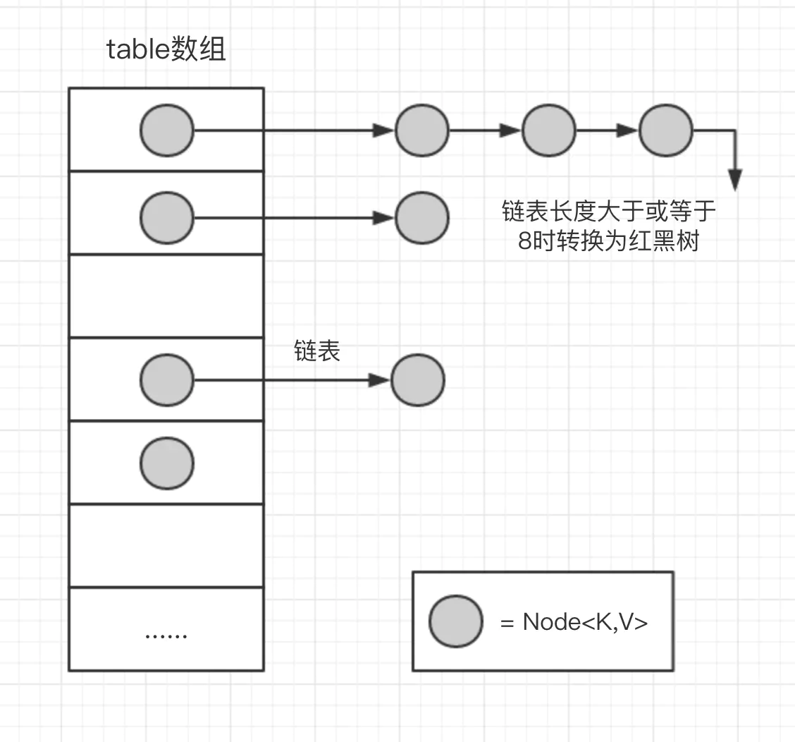
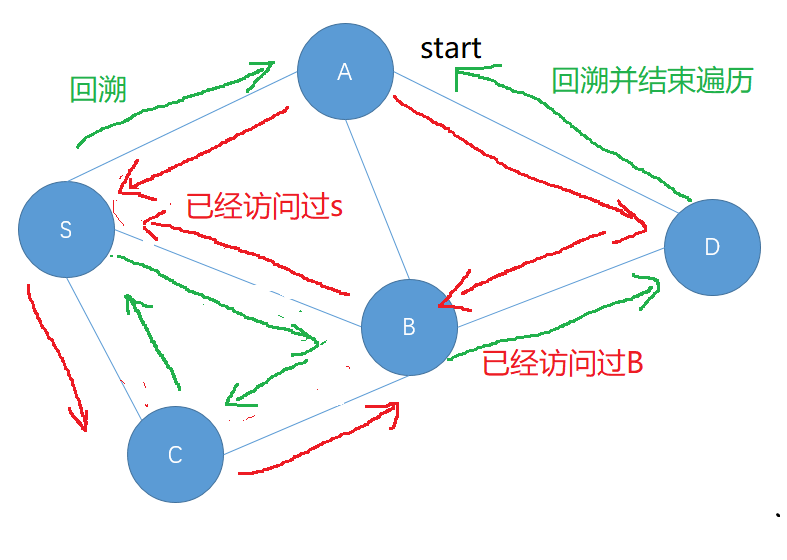

# Week2 Homework And Summary

### 哈希表，映射，集合

### 242.有效字母异位词

**题目**：给定两个字符串 *s* 和 *t* ，编写一个函数来判断 *t* 是否是 *s* 的字母异位词。异位词为两个单词的字母出现次数相同，顺序不同

**case1**：对两个字符串进行排序，比较两个字符串是否相等。时间复杂度O(nlogn)

```java
public boolean isAnagram(String s, String t) {
    char[] ch1 = s.toCharArray();
    char[] ch2 = t.toCharArray();
    
    Arrays.sort(ch1);
    Arrays.sort(ch2);
    
    return Arrays.equals(ch1, ch2);
}
```

**case2**：使用哈希表，判断两个字符串中的字母频率是否相同。时间复杂度O(n)

```java
public boolean isAnagram(String s, String t) {
    byte[] cnt = new byte[26];
    
    for(char c : s.toCharArray()) {
        cnt[c - 'a']++;
    }
    
    for(char c : t.toCharArray()) {
        cnt[c - 'a']--;
        if(cnt[c - 'a'] < 0)
            return false;
    }
   
    return true;
}
```


### 49.字母异位词分组

**题目**：给定一个字符串数组，将字母异位词组合在一起。字母异位词指字母相同，但排列不同的字符串。

**case1**：使用哈希表+排序对异位词分组。对每一个单词排序，若当前哈希表中存在该单词，将单词加入该单词所属的链表组中；不存在则新建链表存储该单词。时间复杂度O(Nklogk)，其中N为单词个数，K为所有单词中的最长长度；空间复杂度为O(NK)

```java
public List<List<String>> groupAnagrams(String[] strs) {
    Map<String, List<String>> mp = new HashMap<>();
    
    for(String word : strs){
        char[] ch = word.toCharArray();
        Arrays.sort(ch);
        
        String key = String.valueOf(ch);
        
        if( !mp.containsKey(key) )  {
            mp.put(key, new ArrayList<String>());
        }
        mp.get(key).add(word);
    }
    
    return new ArrayList(mp.values());
}
```

**case2**：在遍历每一个单词时，不对其进行排序，而是遍历其字符并统计出现频率。时间复杂度为O(NK)，空间复杂度为O(NK)

```java
public List<List<String>> groupAnagrams(String[] strs) {
    Map<String, List<String>> mp = new HashMap<>();
    
    for(String word : strs){
        char[] cnt = new char[26];
        for(char c : word.toCharArray()) 
            cnt[c - 'a']++;
        
        String key = String.valueOf(cnt);
        if(!mp.containsKey(key))
            mp.put(key, new ArrayList<>());
        
        mp.get(key).add(word);
    }
    return new ArrayList(mp.values());
}
```

### HashMap总结

在 Java 语言中，提供了 **HashMap<T>** 封装好的数据结构，根据 key 可以快速取得相应的 value，其底层数据结构如图所示：



**HashMap 中的成员变量**

+ 其存储数组初始容量为 16，存储数组为 Node<K,V> 表，每个节点头后面拉出一条链表，用于解决哈希冲突
+ 负载因子用来确定什么需要对数组扩容。当hashmap中的容量达到总容量的 `0.75` 时，table 会进行扩容。扩容后长度为 curLen * 2，即变成32。数组的长度总是2的幂次
+ 树形化阈值，当解决冲突的链表个数大于等于该值时，查找效率降低，为了提高查找效率，链表会转换为红黑树
+ 解除树形化阈值，当链表个数小于等于该值时，将红黑树转为普通链表

```java
// hashMap数组的初始容量 16
static final int DEFAULT_INITIAL_CAPACITY = 1 << 4;
// 负载因子 0.75f;
static final float DEFAULT_LOAD_FACTOR = 0.75f;
// 树形化阈值 8
static final int TREEIFY_THRESHOLD = 8;
// 解除树形化阈值 6
static final int UNTREEIFY_THRESHOLD = 6;
// 树形化的另一条件 Map数组的长度阈值 64
static final int MIN_TREEIFY_CAPACITY = 64
// 这个就是hashMap的内部数组了，而Node则是链表节点对象。
transient Node<K,V>[] table;
// 数组扩容阈值。
int threshold;
```

其计算哈希索引的函数为如下所示，使用数组长度减一进行与运算，可以均匀的散列索引下标，且与运算可以提高计算速度。为了保证均匀散列，数组长度总是需要为2的幂次方

```
if ((p = tab[i = (n - 1) & hash]) == null)
```

**put(K, V)** 函数

+ 检查数组是否为空，执行 **resize()** 扩容
+ 通过hash值计算数组索引，获取该索引位的首节点
+ 若首节点为 null，直接添加节点到该索引位
+ 首节点不为 null，则
  + key和首节点的 key相同，覆盖 old value
  + 首节点是红黑树节点，将键值对添加到红黑树
  + 首节点是链表，将键值对添加到链表末尾，同时判断是否需要转换位红黑树
+ 添加元素成功后，需要进行一次元素个数阈值检查，并进行相应扩容操作

```java
public V put(K key, V value) {
    return putVal(hash(key), key, value, false, true);
}

// onlyIfAbsent：当存入键值对时，如果该key已存在，是否覆盖它的value。false为覆盖，true为不覆盖 参考putIfAbsent()方法。
// evict：用于子类LinkedHashMap。
final V putVal(int hash, K key, V value, boolean onlyIfAbsent, boolean evict) {
    HashMap.Node<K,V>[] tab; // tab：内部数组
    HashMap.Node<K,V> p;   // p：hash对应的索引位中的首节点
    int n, i;  // n：内部数组的长度    i：hash对应的索引位
    
    // 首次put时，内部数组为空，扩充数组。
    if ((tab = table) == null || (n = tab.length) == 0)
        n = (tab = resize()).length;
    // 计算数组索引，获取该索引位置的首节点，如果为null，添加一个新的节点
    if ((p = tab[i = (n - 1) & hash]) == null)
        tab[i] = newNode(hash, key, value, null);
    else {   
        HashMap.Node<K,V> e; K k;
        // 如果首节点的key和要存入的key相同，那么直接覆盖value的值。
        if (p.hash == hash && ((k = p.key) == key || (key != null && key.equals(k))))
            e = p;
        // 如果首节点是红黑树的，将键值对插添加到红黑树
        else if (p instanceof HashMap.TreeNode)
            e = ((HashMap.TreeNode<K,V>)p).putTreeVal(this, tab, hash, key, value);
        // 此时首节点为链表，如果链表中存在该键值对，直接覆盖value。
        // 如果不存在，则在末端插入键值对。然后判断链表是否大于等于7，尝试转换成红黑树。
        // 注意此处使用“尝试”，因为在treeifyBin方法中还会判断当前数组容量是否到达64，
        // 否则会放弃次此转换，优先扩充数组容量。
        else {
            // 走到这里，hash碰撞了。检查链表中是否包含key，或将键值对添加到链表末尾
            for (int binCount = 0; ; ++binCount) {
                // p.next == null，到达链表末尾，添加新节点，如果长度足够，转换成树结构。
                if ((e = p.next) == null) {
                    p.next = newNode(hash, key, value, null);
                    if (binCount >= TREEIFY_THRESHOLD - 1) // -1 for 1st
                        treeifyBin(tab, hash);
                    break;
                }
                // 检查链表中是否已经包含key
                if (e.hash == hash && ((k = e.key) == key || (key != null && key.equals(k))))
                    break;
                p = e;
            }
        }

        // 覆盖value的方法。
        if (e != null) { // existing mapping for key
            V oldValue = e.value;
            if (!onlyIfAbsent || oldValue == null)
                e.value = value;
            afterNodeAccess(e);
            return oldValue;
        }
    }
    ++modCount; // fail-fast机制
    
    // 如果元素个数大于阈值，扩充数组。
    if (++size > threshold)
        resize();
    afterNodeInsertion(evict);
    return null;
}
```

**resize()** 数组扩容

注意扩容后需要对数组中的元素重新进行哈希，并放置到新数组中的新位置

**get(K)** 函数

+ 检查数组是否为 null 和索引位首节点是否为 null
+ 若索引节点的 hash == key 的hash 或者 key 和索引节点的 key 相同则直接返回
+ 若是红黑色则到红黑树查找
+ 若有冲突，则通过key.equals(k) 查找
+ 都没找到就返回null

```java
public V get(Object key) {
    Node<K,V> e;
    // 也会获取节点时也调用了hash()方法
    return (e = getNode(hash(key), key)) == null ? null : e.value;
}

final Node<K,V> getNode(int hash, Object key) {
    // tab：内部数组  first: 索引位首节点 n: 数组长度 k: 索引位首节点的key
    Node<K,V>[] tab; Node<K,V> first, e; int n; K k;
    // 数组不为null 数组长度大于0 索引位首节点不为null
    if ((tab = table) != null && (n = tab.length) > 0 &&
        (first = tab[(n - 1) & hash]) != null) {
        // 如果索引位首节点的hash==key的hash 或者 key和索引位首节点的k相同
        if (first.hash == hash && // always check first node
            ((k = first.key) == key || (key != null && key.equals(k))))
            // 返回索引位首节点(值对象)
            return first;
        if ((e = first.next) != null) {
            // 如果是红黑色则到红黑树中查找
            if (first instanceof TreeNode)
                return ((TreeNode<K,V>)first).getTreeNode(hash, key);
            do {
                // 发送碰撞 key.equals(k)
                if (e.hash == hash &&
                    ((k = e.key) == key || (key != null && key.equals(k))))
                    return e;
            } while ((e = e.next) != null);
        }
    }
    return null;
}
```


### 树，二叉树，二叉搜索树

二叉树的各种类型题目都跟遍历离不开关系。本质上就是在遍历树的过程中根据题目条件增加相应的操作。拿二叉树来说，其遍历算法主要有：

+ 前序遍历（递归和迭代）
+ 中序遍历（递归和迭代）
+ 后序遍历（递归和迭代）
+ 层次遍历

根据题目的特性，选择合适的遍历算法，在适当位置增加条件即可。通常使用的辅助数据结构为 **栈**，**队列**。

### 94.二叉树的中序遍历

**case1**：使用递归完成中序遍历

```java
private List<Integer> ans = new ArrayList<>();
private void InOrder(TreeNode root){
    if(root == null)
        return;
    InOrder(root.left);
    ans.add(root.val);
    InOrder(root.right);
    return ;
}
public List<Integer> inorderTraversal(TreeNode root) {
    InOrder(root);
    return ans;
}
```

**case2**：使用非递归形式完成中序遍历

```java
public List<Integer> inorderTraversal(TreeNode root) {
        List<Integer> ans = new ArrayList<>();
        Stack<TreeNode> st = new Stack<>();
        TreeNode p = root;
        
        while (p != null || !st.isEmpty()) {
            while (p != null){
                st.push(p);
                p = p.left;
            }
            //当左子树全部入栈
            if(!st.isEmpty()){
                p = st.pop();
                ans.add(p.val);
                p = p.right;
            }
        }
        return ans;
}
```

### 144.二叉树的前序遍历

**case1**：使用递归完成前序遍历操作

```java
private List<Integer> ans = new ArrayList<>();
private void preOrder(TreeNode root){
    if(root == null)
        return ;
    ans.add(root.val);
    preOrder(root.left);
    preOrder(root.right);
    return ;
}
public List<Integer> preorderTraversal(TreeNode root) {
    preOrder(root);
    return ans;
}
```

**case2**：使用非递归形式完成前序遍历操作

```
public List<Integer> preorderTraversal(TreeNode root) {       
        List<Integer> ans = new ArrayList<>();
        Stack<TreeNode> st = new Stack<>();

        TreeNode p = root;
        while(p != null || !st.isEmpty()){
            while(p != null){
                ans.add(p.val);
                st.push(p);
                p = p.left;
            }
            if(!st.isEmpty()){
                p = st.pop();
                p = p.right;
            }
        }
        return ans;
}
```

### 590.N叉树的后序遍历

**case1**：后序遍历为左右根，使用递归完成N叉树的后序遍历

```java
private List<Integer> ans = new ArrayList<>();
private void postOrder(Node root){
    if(root == null)
        return ;

    List<Node> children = root.children;

    for(Node ch : children){
        postOrder(ch);
    }

    ans.add(root.val);
}
public List<Integer> postorder(Node root) {
    postOrder(root);
    return ans;
}
```

**case2**：非递归形式后序遍历

```java
//背诵
public List<Integer> postorder(Node root) {
    List<Integer> ans = new ArrayList<>();
    if(root == null)
        return ans;
    //对于根节点进栈顺序，左右
    Stack<TreeNode> st = new Stack<>();
    st.push(root);
    //出栈访问顺序为根右左
    while (!st.empty()) {
        root = st.pop();
        list.add(root.val);
        for(Node ch : root.children)
            st.push(ch);        
    }
    //逆序后为：左右根
    Collections.reverse(ans);
    return ans;
}
```

### 589.N叉树的前序遍历

**case1**：递归完成前序遍历

```java
private List<Integer> ans = new ArrayList<>();
private void preOrder(Node root) {
    if(root == null)
        return;

    ans.add(root.val);
    for(Node ch : root.children)
        preOrder(ch);
    return ;
}
public List<Integer> preorder(Node root) {
    preOrder(root);
    return ans;
}
```

**case2**：使用非递归形式完成前序遍历

```java
//背诵
public List<Integer> preorder(Node root) {
    List<Integer> ans = new ArrayList<>();
    if(root == null)
        return ans;
    Stack<Node> st = new Stack<>();
    st.push(root);
    
    while(!st.empty()){
        //访问根节点
        root = st.pop();
        ans.add(root.val);
        
        //逆序加入孩子节点
        for(int i = root.children.size() - 1; i >= 0; i--)
            st.add(root.children.get(i));
    }
    return ans;
}
```

### 429.N叉树的层序遍历

层序遍历需要借助队列。

```java
public List<List<Integer>> levelOrder(Node root) {
    List<List<Integer>> ans = new ArrayList<>();
    if(root == null)
        return ans;
    Queue<Node> node = new LinkedList<>();
    
    //队头队尾指针
    int front = -1, rear = -1;
    
    //当前层的最后一个节点
    int last = 0;
    
    List<Integer> tmp = new ArrayList<>();
    
    node.offer(root);
    rear++;
    
    while (!node.empty()){
        Node cur = node.poll();
        front++;
        tmp.add(cur.val);
        
        //加入孩子节点
        for(Node ch : cur.children){
            node.offer(ch);
            rear++;
        }
        
        //判断是否结束本层遍历
        
        if(front == last){
            //注意需要重新构建链表再加入ans中，否则加入的是同一个引入
            List<Integer> lst = new ArrayList(tmp);
            ans.add(lst);
            tmp.clear();
            last = rear;          
        }        
    }
    return ans;
}
```


### 堆

由于堆的特性，其主要用于得到一堆数据中最大最小值，且可以用于快速得到有序序列。其中

+ 大顶堆用于得到升序序列
+ 小顶堆用于得到降序序列

利用堆的堆顶性质，可以使用固定存储空间的堆来处理海量的数据，每次只需要比较当前元素和堆顶元素，来进行元素的出堆和入堆操作

### 剑指offer40.最小的k个数

**题目**：输入整数数组 `arr` ，找出其中最小的 `k` 个数。其中数组元素可以重复

`case1`：排序。然后在排序数组中选择前k个数，时间复杂度为O(nlogn)，空间复杂度O(logn)（排序空间）

```java
public int[] getLeastNumbers(int[] arr, int k) {
    if(arr.length == 0 || k == 0)
        return new int[0];
    int[] ans = new int[k];
    Arrays.sort(arr);
    int cnt = 0;
    
    for(int i = 0; i < k; i++)
        ans[i] = arr[i];
    return ans;
}
```

`case2`：使用大根堆维护数组的前 `k`大值。先将数组的前 `K`个数插入堆中，随后从`k + 1`个数开始遍历，有

+ cur < heap.top(), 弹出堆顶元素，加入cur
+ cur > heap.top()，继续下一个元素

最后将堆中的所有 k 个元素返回即可，时间复杂度O(nlogk)，堆中维护k个元素，插入删除操作为O(logk)，最坏情况下n个元素都要插入一次堆中；空间复杂度为O(k)

```java
public int[] getLeastNumbers(int[] arr, int k) {
    int[] ans = new int[k];
    if(arr.length == 0 || k == 0)
        return ans;
    
    //自实现比较规则转为大顶堆，默认为小顶堆
    //lambda表达式
    //1.(parameters) -> expression
    //2.(parameters) -> {statements;}
    PriorityQueue<Integer> mq = new PriorityQueue((x,y) -> y - x);
    
    for(int i = 0; i < k; i++)
        mq.offer(arr[i]);
    
    for(int i = k; i < arr.length; i++){
        if(arr[i] < mq.peek()){
            mq.poll();
            mq.offer(arr[i]);
        }
    }
        
    for(int i = 0; i < k; i++)
        ans[i] = mq.poll();
    return ans;
    
}
```

### 剑指offer 49.丑数

**题目**：我们把只包含质因子 2、3 和 5 的数称作丑数。求按从小到大的顺序的第 n 个丑数。

`case1` ：暴力求解。维护一个计数器cnt，从1开始判断当前数是否是丑数，是则计数器加1，直到n为止。丑数只能包含质因子2, 3, 5。时间复杂度爆炸，超出时间限制

```java
//判断是否是丑数
boolean isUglyNum(int num){
    if(num == 1)
        return true;
    //不断除2，3，5
    while(num % 2 == 0)
        num /= 2;
    while(num % 3 == 0)
        num /= 3;
    while(num % 5 == 0)
        num /= 5;
    
    return num == 1;
}

public int nthUglyNumber(int n) {
    int cnt = 0;
    int num = 1;
    
    while(true){
        if(isUglyNum(num))
            cnt++;
        if(cnt == n)
            return num;
        num++;
    }
}
```

`case2` ：丑数只能包含2，3，5质因子，则可得后面的丑数是由前面的丑数乘以若干个2，3，5得到的。我们可以维护一个小顶堆，堆中首先放入丑数 `1`。

+ 弹出1，从1可以得到2，3，5丑数，放入堆中
+ 弹出2，从2可以得到4，6，10丑数，放入堆中
+ **注意在加入新的丑数过程中需要去重**（使用集合）

我们在往堆中放入丑数的过程需要对当前已得的丑数进行计数，当弹出的丑数为第 `k - 1` 个时，堆顶元素即为第 `k` 个丑数。整个过程利用了堆的元素有序性。时间复杂度为O(nlogn)，空间复杂度为O(n)

```java
public int nthUglyNumber(int n) {
    PriorityQueue<Long> mq = new PriorityQueue<>();
    
    Set<Long> ms = new HashSet<Long>();
    mq.offer(1l);
    ms.add(1l);
    int cnt = 0;
    
    int[] factor = {2,3,5};
    while(true){
        long num = mq.poll();
        cnt++;
        if(cnt == n)
            return (int)num;
        for(int f : factor){
            long sum = f * num;
            if(!ms.contains(sum)){
                ms.add(sum);
                mq.offer(sum);
            }
        }
    }
}
```

`case3`：动态规划。我们已知 **丑数 = 丑数 * 2/3/5** ，假设当前存在3个序列，分别表示丑数序列从1开始分别乘以2，3，5的序列

```
nums2 = {1*2, 2*2, 3*2, 4*2, 5*2, 6*2, 8*2,...}
nums3 = {1*3, 2*3, 3*3, 4*3, 5*3, 6*3, 8*3,...}
nums5 = {1*5, 2*5, 3*5, 4*5, 5*5, 6*5, 8*5,...}
```

则最终的丑数序列实际上是这三个有序序列对的合并结果，计算丑数序列相当于合并3个丑数序列

我们可以每一个序列各自维护一个指针，每次将三个序列中**最小元素**放入合并数组中，并后移相应指针。在合并过程中，我们需要注意重复元素的处理。时间复杂度为O(n)

``` java
public int nthUglyNumber(int n) {
    int[] ans = new int[n];
    ans[0] = 1;
    int p2 = 0, p3 = 0, p5 = 0;
    for(int i = 1; i < n ; i++){
        ans[i] = Math.min(Math.min(ans[p2] * 2, ans[p3] * 3), ans[p5] * 5);
        
        //移动相应指针并处理重复元素
        if(ans[i] == ans[p2] * 2)
            p2++;
        if(ans[i] == ans[p3] * 3)
            p3++;
        if(ans[i] == ans[p5] * 5)
            p5++;
    }
    
    return ans[n - 1];
}
```

### 347.前K个高频元素

**题目**：给定一个非空的整数数组，返回其中出现频率前 **k** 高的元素。

`case1`：哈希表计数 + 排序。使用哈希表map记录每个数字出现的频次，然后按照数字频次进行排序，最终得到前k高频次的元素。时间复杂度O(nlogn)，空间复杂度O(n)

```java
public int[] topKFrequent(int[] nums, int k) {
    int[] ans = new int[k];
    Map<Integer, Integer> cnt = new HashMap<>();
    
    for(int n : nums){
        if(cnt.containsKey(n))
            cnt.put(n, cnt.get(n) + 1);
        else
            cnt.put(n, 1);
    }
    
    //将map键值对放入list中进行排序
    ArrayList<Map.Entry<Integer, Integer>> entry = new ArrayList<>(cnt.entrySet());
    
    //自定义比较器规则，按照数字频次降序排序
    entry.sort((x, y) -> y.getValue() - x.getValue());
    
    for(int i = 0; i < k; i++)
        ans[i] = entry.get(i).getKey();
    
    return ans;
}
```

`case2`：哈希计数 + 最小堆。使用堆维护前k个最大元素，对于k频次之后的数字可以不去处理，进一步优化时间复杂度。类似于丑数，我们先将k个数字加入堆中，在剩余的 `n - k` 个数字中，

+ 若 freq[cur] > freq[top]，弹出堆顶元素，加入当前元素

时间复杂度为O(nlogk)，空间复杂度为O(n)

```java
public int[] topKFrequent(int[] nums, int k) {
    int[] ans = new int[k];
    Map<Integer, Integer> mp = new HashMap<>();
    for(int n : nums){
        if(mp.containsKey(n))
            mp.put(n, mp.get(n) + 1);
        else
            mp.put(n, 1);
    }
    //按照频次升序排序
    PriorityQueue<Map.Entry<Integer, Integer>> cnt = new PriorityQueue(
        (x, y) -> x.getValue() - y.getValue()
    );
    
    for(Map<Integer, Integer> entry : mp.entrySet()){
        if(cnt.size() < k)
            cnt.offer(entry);
        else if(entry.getValue() > cnt.peek().getValue()){
            cnt.poll();
            cnt.offer(entry);
        }
    }
    
    for(int i = 0; i < k; i++)
        ans[i] = cnt.poll().getKey();
    return ans;
}
```

### 自实现堆排序

```java
public class HeapSort {
    //大顶堆实现升序排序
    public void heapSort(int[] arr) {
        int n = arr.length;
        
        //建堆,从最后一个非叶子节点开始调整
        for(int i = n / 2 - 1; i >= 0; i--)
            heapify(arr, n, i);
        
        //从堆中依次拿出堆顶元素，升序排序
        for(int i = n - 1; i > 0; i--){
            int tmp = arr[0];
            arr[0] = arr[i];
            arr[i] = tmp;
            
            //每次拿出堆顶元素，都要进行堆调整
            heapify(arr, i, 0);
        } 
    }
    
    //从i结点开始至n节点结束，调整堆
    void heapify(int[] arr, int n, int i){
        //对节点进行下浮操作，保持大根堆性质
        int max = i;
        //左右孩子
        int left = 2 * i + 1;
        int right = 2 * i + 2;
        
        //若孩子节点关键字大，挑选最大的孩子节点
        if(left < n && arr[left] > arr[max])
            max = left;
        if(right < n && arr[right] > arr[max])
            max = right;
        
        //交换根节点和孩子节点
        if(max != i){
            int tmp = arr[i];
            arr[i] = arr[max];
            arr[max] = tmp;
            
            //继续递归调整max的子树
            heapify(arr, n, max);
        }
    }
}
```


### 图

图的应用本质上在于图的遍历。图的遍历算法主要有

+ 深度优先搜索
+ 广度优先搜索

由于图会存在环路，在遍历过程中会重复访问某些节点，因此我们需要标记数组visited，来记录被访问过的节点防止重复遍历。图的应用 **最小生成树**， **最短路径**，**拓扑排序** 等等，都是建立在图的遍历方法上。

**深度优先搜索**

图的深度优先搜索，从起始节点开始沿着其连接的节点一路向下探索，直到走到无连接点或者走到重复节点后，向上回溯。由于其回溯特性，深度优先搜索使用递归实现。其通常用于求解某个问题是否存在一个有效解，其中求解的过程就是从起始节点开始到终结点的路径



```c++
//深度优先搜索实现模板
//假设图以邻接矩阵表示
//四个方向
int dir[4][2] = {{-1,0}, {1,0}, {0,-1}, {0,1}};
void dfs(vector<vector<int>> graph, vector<vector<int>> &visited, int x, int y){
	//标记访问节点
	visited[x][y] = 1;
    
    //从其周围四个方向中选择相邻点向下探索
    for(int i = 0; i < 4; i++){
        int nx = x + dir[i][0];
        int ny = y + dir[i][1];
        
        //判断下一个点是否合法
        if(nx < 0 || nx >= graph.size() || ny < 0 || ny >= graph[0].size())
            continue;
        
        //节点相邻且没有被访问过
        if(graph[nx][ny] == 1 && !visited[nx][ny])
            dfs(graph, visited, nx, ny);
        
        //回溯相应操作
    }
}
```

**广度优先搜索**

从图的起点开始，每次都会先把当前点的所有相邻点遍历完，然后继续在相邻点中遍历其所有相邻点。如

+ 遍历1，1和2，3，4相邻
+ 遍历2，3，4，2和5，6相邻，3和9相邻，4和7相邻
+ 遍历5，6，遍历9，遍历7

其具有一层一层扩散的性质，因此类似于树的层次遍历，使用队列来完成遍历过程。通常用来求解连通性问题和最优解问题，最优解问题就是其扩散的最小的层数

```c++
//广度优先搜索
int dir[4][2] = {{-1,0}, {1,0}, {0,-1}, {0,1}};

void bfs(vector<vector<int>> graph, vector<vector<int>> &visited, int x, int y) {
    //使用队列完成广度优先搜索
    queue<pair<int, int>> node;
    node.push({x, y});
    visited[x][y] = 1;
    
    while(!node.empty()){
        auto [x, y] = node.front();
        node.pop();
        for(int i = 0; i < 4; i++){
            int nx = x + dir[i][0];
            int ny = y + dir[i][1];
            
            if(nx < 0 || nx >= graph.size() || ny < 0 || ny >= graph[0].size())
                continue;
            
            if(graph[nx][ny] == 1 && !visited[nx][ny]){
                node.push({nx, ny});
                visit[nx][ny] = 1;
            }
        }
    }
}
```

**拓扑排序**

拓扑排序常用来判断图是否存在环，若图中没有环，则用来求解一个具有前提条件的活动序列。

+ 首先遍历所有入度为0的节点，将其相连节点入度减1
+ 若出现新的入度为0的点，重复步骤1
+ 最后遍历的节点个数为0时，图中没有环，则存在有效的拓扑序列

由于需要保证顺序遍历节点，使用队列作为辅助数据结构，还需要维护节点的入度数

```java
class Graph{
    //节点编号
    int num;
    //邻接节点列表
    List<Integer> next;
}
//具有n个节点的图，其节点编号为0,1,..., n - 1
//节点入度数组
//计算拓扑序列
List<Integer> topologicalSort(Graph[] graph, int[] degree){
    List<Integer> ans = new ArrayList<>();
    Queue<Integer> node = new LinkedList<>();
    
    //将入度为0的节点入队
    for(int i = 0; i < degree.length; i++){
        if(degree[i] == 0)
            node.offer(i);
    }
    
    //计算遍历的节点数，
    int cnt = 0;
    while(!node.isEmpty()){
        int num = node.poll();
        ans.add(num);
        cnt++;
        //将其相邻节点入度减1
        for(int v : graph[num].next){
            degree[v]--;
            if(degree[v] == 0)
                node.offer(v);
        }
    }
    
    //判断是否存在拓扑序列
    if(cnt != degree.length)
        ans.clear();
    return ans;
}
```

**最短路径**

最短路径算法常用 **Dijkstra算法**，所求问题为从图中的某个顶点出发到达另外一个顶点的所经过的边权重和最小的一条路径

**Dijkstra算法** 使用广度优先搜索解决了权重有向图或者无向图的 **单源最短路径问题**，算法最终可得起点到其余每个点的最短路径

+ 声明一个数组 `dis[]` 来保存源点到各个顶点的最短路径，一个顶点集合 `T` 来保存已经找到了最短路径的顶点
+ 初始化时 `dis[s] = 0` 源点最短距离为0，对于源点 s 可达的边 `(s, v)` 把 `dis[v] = w` ，其中 w 为边的权重值
+ 对于新加入的顶点 v 进行同样的操作并更新距离数组，直到 T 集合包含了所有的顶点

```c++
struct Edge{
    int to;
    int length;
    Edge(int t, int l) : to(t), length(l){}
};

struct Point{
    //顶点编号
    int number;
    //源点到该点距离
    int distance;
    Point(int n, int d) : number(n), distance(d) {}
    //定义比较函数，距离小的优先级高
    bool operator < (const Point& p) const{
        return distance > p.distance;
    }
};

//n 个顶点，顶点编号为0,1,..., n - 1
vector<Edge> graph[n];
int dis[n];

void dijsktra(int s) {
    //使用优先队列
    priority_queue<Point> mq;
    dis[s] = 0;
    mq.push(Point(s, dis[s]));
    
    //更新距离值
    while(!mq.empty()) {
        //找到离源点最近的点
        int u = mq.top().number;
        mq.pop();
        
        //更新邻接点距离
        for(int i = 0; i < graph[u].size(); i++){
            int v = graph[u][i].to;
            int d = graph[u][i].length;
            if(dis[u] + d < dis[v]) {
                dis[v] = dis[u] + d;
                mq.push(Point(v, dis[v]));
            }                         
        }
    }
    return ;
}
```

**最小生成树**

在无向连通图中，若存在一个连通子图，它包含原图中的所有顶点和部分边，且该子图不存在回路，所有边的权重之和最小，则该子图被称为 **最小生成树**

最小生成树常用的 **Kruskal 算法**，其原理为：在要求解的连通图中，任意选择一些点属于集合A，剩余的点属于集合B，最小生成树必定存在一条权值最小的边，该边的两个顶点分别属于集合A，B（连通两个集合的边）。其步骤如下：

+ 开始时所有顶点属于孤立的集合，
+ 按照边权重递增顺序遍历所有边，若遍历的边的顶点属于不同的集合，则该边属于最小生成树，将该边的两个顶点所属集合合并
+ 遍历完所有边，若原图连通，则得到最小生成树；否则原图不连通，最小生成树不存在

由于存在集合的合并问题，我们可以使用并查集来实现算法

```c++
struct Edge{
    //边的两个顶点
    int from;
    int to;
    int length;
    //定义边的比较函数
    bool operator < (const Edge& e) const {
        return length < e.length;
    }    
};
//n个顶点,边的集合,顶点编号为0, 1, ..., n - 1
Edge edge[n * n];

//并查集
int father[n];
int height[n];

//并查集初始化，每个顶点孤立
void Initial(int n) {
    for(int i = 0; i < n; i++){
        father[i] = i;
        height[i] = 0;
    }        
}

//查找集合的根节点,路径压缩
int Find(int x) {
    if(x != father[x]){
        father[x] = Find(father[x]);
    }
    return father[x];
}

//合并两个集合
void Union(int x, int y){
    x = Find(x);
    y = Find(y);
    
    if(x != y){
        if(height[x] < height[y])
            father[x] = y;
        else if(height[x] > height[y])
            father[y] = x;
        else{
            father[y] = x;
            height[x]++;
        }
    }
    return ;
}

//最小生成树算法，传入顶点个数，边数
int Kruskal(int n, int edgeNum) {
    Initial(n);
    //对边进行排序
    sort(edge, edge + edgeNum);
    //最小权重和
    int sum = 0;
    for(int i = 0; i < edgeNum; i++){
        Edge e = edge[i];
        //检查边的两个顶点是否是同一个集合
        if(Find(e.from) != Find(e.to)){
            Union(e.from, e.to);
            sum += e.length;
        }
    }
    return sum;
}
    
```

