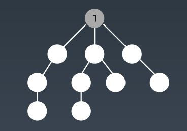
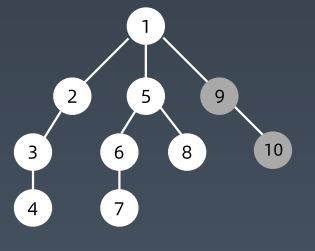
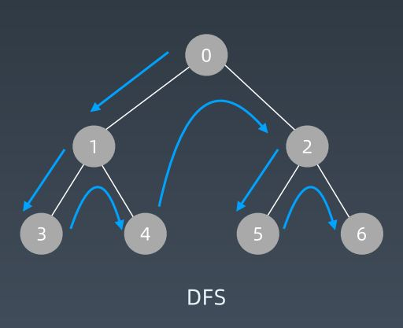
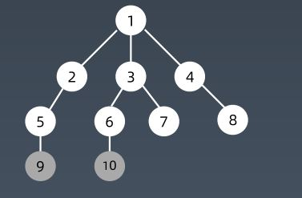
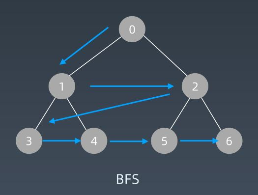

学习笔记

### 搜索

搜索用在遍历图和树的结构中。其具有以下特点：

+ 每个结点都需要访问一次
+ 每个结点有且只能访问一次

本章节重点关注于图的搜索算法。由于图具有连通性，在遍历过程可能同一个结点会被遍历两次，我们需要使用标记数组来记录哪些结点已经被访问过，防止重复遍历结点

**深度优先搜索**

深度优先搜索是图的一种搜索遍历方式，它的特点为从起始结点开始，沿着其邻接结点向下探索，对于下一个结点继续沿着邻接结点向下探索。由于其搜索特性，该方法的遍历路径类似于从一条路径上从头走到尾，然后向上一个结点回溯并探索另一个分支

如以下图片所示，1结点为起点结点，开始深度优先搜索过程，结点数字表示结点访问的顺序





深度优先搜索的示意图如下：



由于深度优先搜索具有递归回溯性质，其搜索代码通常使用递归写法完成，其代码模板如下：

```java
//visited : 标记数组
public void dfs(startNode, visited) {
    //递归终止条件，结点已经被遍历过，回溯
    if(startNode in visited)
        return;
    //否则遍历该结点，并标记
    visited.add(startNode);
    //对该结点的邻接结点，任选一个分支进行向下探索
    for(node : startNode.child()){
        //剪枝
        if(node notin visited)
            dfs(node, visited);
    }    
}
    
```

当然，深度优先搜索也可以使用迭代的方式完成，通常我们需要自己模拟维护一个栈

```java
public void dfs(startNode){
    int[] visited;
    Stack<node> st = new Stack<>();
    st.push(startNode);
    while(!st.empty()){
        cur = st.pop();
        visited.add(cur);
        
        //随机选择一个孩子分支
        next = cur.getchild();
        stack.push(next);
    }    
}
```

**广度优先搜索**

广度优先搜索是图的另一种搜索遍历方式，它的特点是从起始点开始，一次性遍历所有与起始点邻接的结点，然后又从这些邻接结点出发，一次遍历他们的所有邻接点。该方法的遍历路径类似树中的层次遍历方法，具有层层扩展的趋势。






由于广度优先搜索的层次拓展性，我们使用队列来完成对图的遍历，其代码模板如下：

```java
public void bfs(startNode,visited){
    Queue<Node> node = new LinkedList<>();
    node.offer(startNode);
    visited.add(startNode);
    
    while(!node.isEmpty()){
        Node cur = node.poll();
        
        process(cur);
        next = cur.getChild();
        node.offer(next);
        visited.add(next);
    }
}
```

### 贪心算法

在解决一个问题时，我们需要分步去解决问题。所谓贪心，指在问题的每一步选择中，都选择当前情况下最好或最优的选择，从局部最优最终得到一个全局最优解。

能够使用贪心算法解决的问题需要具有一定特征：原问题可以划分为许多小问题，每个小问题之间互相不重叠且每一步的选择不会影响到下一步的选择。这样的问题称为具有最优子结构。

我们发现贪心算法的解题思路和动态规划很像，都是对每个子问题做出一个最优选择，最终达到全局最优结果。

但是在贪心中，当前步的选择不会影响下一步的结果，即每一步的选择都是不能回退的，而是逐渐往后拓展递推的，顺着每个子问题选择最优最终就可以达到全局最优。

而在动态规划中，子问题之间具有重叠性，当前子问题的选择结果可能会影响到其他子问题的选择结果。所以我们通常使用一个备忘录来保存每一步的选择，并根据以前的结果对当前问题进行选择，具有回退的功能，最终来达到全局最优解。

由于贪心算法的特殊性，我们在使用贪心算法求解问题时，必须保证问题具有最优子结构，并且要证明，贪心算法最终可以得到全局最优解。但是在实际问题中，具有这样特征的问题不多，所以贪心算法通常是与其他方法结合在一起使用，在问题的某一步骤中使用贪心思想作为辅助算法，而不是只使用贪心算法来解决整个问题

### 二分查找

二分查找一个中快速的查找方式，其基本思想为每次根据条件排除数组的一半，只在另一半中查找特定元素，可得平均查找时间复杂度为 O(logn)。

二分查找的运用需要数组具备特定的前提条件：

+ 数组元素具有单调性，递增或递减
+ 数组存在上下界，使得最终收敛

其中二分查找的代码模板如下：

```java
public int binarySearch(int[] nums, int target) {
    int left = 0;
    int right = nums.length - 1;
    while(left <= right){
        int mid = left + (right - left) / 2;
        if(nums[mid] == target)
            return mid;
        else if(nums[mid] < target)
            left = mid + 1;
        else
            right = mid - 1;
    }
    return -1;
}
```

