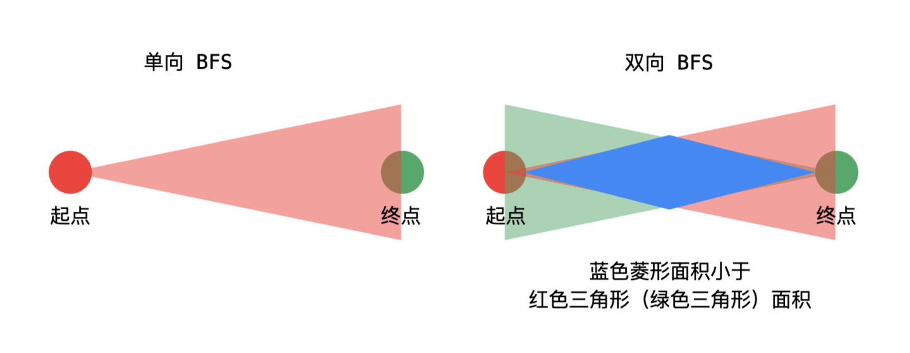

# Week4 Homework And Summary

### 广搜，深搜

**题目** ：给你一个二叉树，请你返回其按 **层序遍历** 得到的节点值。 （即逐层地，从左到右访问所有节点）。

**解题思路**

**case1**：题目要求实现树的层次遍历，使用队列作为辅助结构，同时需要维护额外遍历来记录当前层数

```java
//使用头尾指针记录当前层
public List<List<Integer>> levelOrder(TreeNode root) {
    List<List<Integer>> ans = new ArrayList<>();
    if(root == null)
        return ans;
    
    Queue<TreeNode> node = new LinkedList<>();
    List<Integer> tmp = new ArrayList<>();
    int front = -1, rear = -1;
    int last = 0;
    node.offer(root);
    rear++;
    
    while(!node.isEmpty()){
        TreeNode cur = node.poll();
        front++;
        tmp.add(cur.val);
        
        if(cur.left != null){
            node.offer(cur.left);
            rear++;
        }
        if(cur.right != right){
            node.offer(cur.right);
            rear++;
        }
        if(front == last){
            ans.add(new ArrayList(tmp));
            tmp.clear();
            last = rear;
        }
    }
    return ans;
}
```

```java
//每次遍历时将当前层所有结点一次性取出
public List<List<Integer>> levelOrder(TreeNode root) {
    List<List<Integer>> ans = new ArrayList<>();
    if(root == null)
        return ans;
    Queue<TreeNode> node = new LinkedList<>();
    node.offer(root);
    
    while(!node.isEmpty()){
        //一次性把当前层结点全部遍历
        int count = node.size();
        List<Integer> tmp = new ArrayList<>();
        
        while(count > 0){
            TreeNode cur = node.poll();
            tmp.add(cur.val);
            if(cur.left != null)
                node.offer(cur.left);
            if(cur.right != null)
                node.offer(cur.right);
            count--;
        }
        ans.add(tmp);
    }
    return ans;
}
```

### 最小基因变化

**题目** ：给定初始基因序列，给定目标基因序列，规定

+ 每次进行基因变化时只能变一个字符
+ 变化得到的基因需要在给定的基因库中

我们需要得到由初始基因序列到目标基因序列变换的最少次数

**解题思路**

假设给定基因长度为 n，则每次变化的可能情况有 n 个，寻找最少次数且根据其变化特点，我们使用图的广度优先搜索来解题，将每个基因当做是图的结点，基因库使用集合存储，然后我们还需要使用一个集合记录已经扩展搜索的基因。每一层的扩展结点为当前结点经过一个字符变化且在基因库中的序列。

```java
//判断两个字符是否只相差一个基因
private boolean diff(String x, String y) {
    int ans = 0;
    for(int i = 0; i < x.length(); i++){
        if(x.charAt(i) != y.charAt(i)){
            ans++;
            if(ans > 1){
                return false;
            }
        }
    }
    return true;
}
public int minMutation(String start, String end, String[] bank) {
    //广度优先搜索
    Set<String> dict = new HashSet<>();
    for(String b : bank){
        dict.add(b);
    }
    
    //目标序列不在基因库内
    if(!dict.contains(end)){
        return -1;
    }
    //记录已经扩展过的基因
    int ans = 0;
    Set<String> ex = new HashSet<>();
    Queue<String> node = new LinkedList<>();
    node.offer(start);
    ex.add(start);
    
    while(!node.isEmpty()){
        //将当前层的全部序列遍历
        int count = node.size();
        while(count > 0) {
            String cur = node.poll();
            if(cur.equals(end))
                return ans;
            //扩展状态，在基因库中找只有一个字符不同的序列
            for(String str : dict){
                if(diff(str, cur) && !ex.contains(str)){
                    node.offer(str);
                    ex.add(str);
                }
            }
            
        }
        ans++;
    }
    return -1;
}
```

### 515.在每个树行中找最大值

**题目**：您需要在二叉树的每一行中找到最大的值。

**解题思路**：我们需要找出树中每层的最大数值，根据题目特性使用层次遍历的方法，使用队列作为辅助结构。注意在循环中，需要一次性将当前层的结点全部遍历完

```java
public List<Integer> largestValues(TreeNode root) {
    List<Integer> ans = new ArrayList<>();
    if(root == null)
        return ans;
    Queue<TreeNode> node = new LinkedList<>();
    node.offer(root);
    
    while(!node.isEmpty()){
        int count = node.size();
        int maxn = Integer.MIN_VALUE;
        while(count > 0){
            TreeNode cur = node.poll();
            maxn = Math.max(maxn, cur.val);
            if(cur.left != null)
                node.offer(cur.left);
            if(cur.right != null)
                node.offer(cur.right);
            count--;
        }
        ans.add(maxn);
    }
    return ans;
}
```

### 127.单词接龙

**题目** ：给定初始单词和目标单词，一个字典，找到从初始单词到目标单词的最短转换序列长度，转换规则如下：

+ 每次转换只能改变一个字母
+ 转换过程中的中间单词必须是字典中的单词

**解题思路**

该题是 **最小基因变换** 的题目的变体，使用同样方法求解该题即可。但是在扩展单词的步骤中，我们需要枚举每一对单词的组合，判断他们是否恰好相差一个字符，但是这样效率太低，需要优化建图

我们可以创建虚拟节点，对于单词 **hit**，我们创建三个虚拟节点 `*it`, `h*t`, `hi*`，然后依次结点这些虚拟结点是否存在于字典库中

```java
public int ladderLength(String beginWord, String endWord, List<String> wordList) {
        Set<String> dict = new HashSet<String>();
        for(String word : wordList){
            dict.add(word);
        }

        if(!dict.contains(endWord))
            return 0;

        Set<String> ex = new HashSet<>();
        Queue<String> node = new LinkedList<>();
        int ans = 0;
        ex.add(beginWord);
        node.offer(beginWord);

        while(!node.isEmpty()){
            int count = node.size();
            ans++;
            while(count > 0){
                String cur = node.poll();
                //System.out.println(cur);
                if(cur.equals(endWord))
                    return ans;
                
                //改变一个字符
                changeOneChar(cur, dict, node, ex);
                
                //System.out.println(node.size());
                count--;
            }
        }
        return 0;
    }

public void changeOneChar(String cur, Set<String> dict, Queue<String> node, Set<String> ex) {
        char[] array = cur.toCharArray();

        //对每一个字母进行替换
        for(int i = 0; i < array.length; i++){
            char origin = array[i];
            for(char c = 'a'; c <= 'z'; c++){
                if(origin == c)
                    continue;
                array[i] = c;
                String next = String.valueOf(array);
                if(dict.contains(next) && !ex.contains(next)){
                    node.offer(next);
                    ex.add(next);
                }
            }
            //将原字符替换回去
            array[i] = origin;
        }
    }
```

我们已知目标顶点，可以分别从起点和目标终点执行广度优先遍历，当两个遍历产生交集时，遍历停止，两者遍历迭代步数即为最小步数，这就是 **双向广度优先遍历的思想**

因为是双向广度优先遍历，我们需要两个队列分别记录从头和从尾的遍历集合，**每次从数量小的集合开始扩散**，遍历速度更快



```java
public int ladderLength(String beginWord, String endWord, List<String> wordList) {
    //词典库
    Set<String> dict = new HashSet<>(wordList);
    if(!dict.contains(endWord))
        return 0;
    
    //记录已经扩展过的单词
    Set<String> ex = new HashSet<>();
    //前后两个队列
    Set<String> left = new HashSet<>();
    Set<String> right = new HashSet<>();
    
    ex.add(beginWord);
    ex.add(endWord);
    
    left.add(beginWord);
    right.add(endWord);
    
    int ans = 1;
    
    //双向bfs
    while(!left.isEmpty() && !right.isEmpty()) {
        //选择短的队列进行扩展
        if(left.size() > right.size()) {
            Set<String> tmp = left;
            left = right;
            right = tmp;
        }
        //使用新队列保存扩展的结果
        Set<String> next = new HashSet<>();
        for(String cur : left) {
            //判断是否能够继续扩展，不能则产生交集
            if(isInterConnect(cur, dict, ex, right, next)) {
                return ans + 1;
            }            
        }
        left = next;
        ans++;
    }
    return 0;
}

//判断是否产生交集
private boolean isInterConnect(String cur, Set<String> dict, Set<String> ex, Set<String> right, Set<String> next) {
    char[] array = cur.toCharArray();
    for(int i = 0; i < array.length; i++) {
        char origin = array[i];
        for(char c = 'a'; c <= 'z'; c++) {
            if(c == origin)
                continue;
            array[i] = c;
            String word = String.valueOf(array);
            if(dict.contains(word)){
                //产生交集
                if(right.contains(word))
                    return true;
                if(!ex.contains(word)) {
                    //扩展
                    ex.add(word);
                    next.add(word);
                }
            }
                
        }
        array[i] = origin;
    }
    return false;
}
```

### 126.单词接龙II(困难)

**题目** ：单词接龙II中，要求得到从初始单词到目标单词所有的最短转换序列，那么我们需要存储每一次扩展的单词。最后得到所有从初始单词到目标单词的转换路径列表。主要思路为：在到达最短路径所在的层时，记录并输出所有符合条件的路径

+ 在单词接龙的基础上，需要将找到的最短路径存储下来
+ 每次需要存储扩展之后的多个结果列表：start = 'ab', end = 'if', {cd, af, ib, if}
  + 第一层：{ab}
  + 第二层：{ab, af}, {ab, ib}
  + 第三层：{ab, af, if}, {ab, ib, if}
+ 如果该层添加的某一个单词符合目标单词，则该路径为最短路径，该层为最短路径所在的层，不需要再扩展。但还不能直接返回结果，必须将该层的所有路径列表遍历完，得到所有符合条件的结果
+ 每层添加单词时，不可以直接将遍历的单词添加到标记集合，需要每一层有一个单独标记集合。在该层所有的列表都遍历完后，再将所有的访问过的标记单词添加到总标记集合中，否则会遗漏结果路径

```java
public List<List<String>> findLadders(String beginWord, String endWord, List<String> wordList) {
    //单词库集合
    Set<String> dict = new HashSet<>(wordList);
    List<List<String>> ans = new ArrayList<>();
    //字典中不包含目标单词
    if(!dict.contains(endWord)) 
        return ans;
    
    //标记集合
    Set<String> ex = new HashSet<>();
    //记录每一层结果的队列
    Queue<List<String>> node = new LinkedList<>();
    node.offer(Arrays.asList(beginWord));
    ex.add(beginWord);
    
    //判断是否需要继续扩展
    boolean flag = true;
    while(!node.isEmpty() && flag) {
        //上一层需要扩展的列表数
        int count = node.size();
        
        //扩展时单独的标记集合
        Set<String> visit = new HashSet<>();
        for(int i = 0; i < count; i++){
            List<String> path = node.poll();
            //获取扩展单词
            String cur = path.get(path.size() - 1);
            char[] array = cur.toCharArray();
            
            //扩展
            for(int j = 0; j < array.length; j++){
                char origin = array[j];
                for(char c = 'a'; c <= 'z'; c++) {
                    if(origin == c)
                        continue;
                    array[j] = c;
                    String next = String.valueOf(array);
                    if(dict.contains(next) && !ex.contains(next)) {
                        //生成新路径
                        List<String> newPath = new ArrayList<>(path);
                        newPath.add(next);
                        
                        //判断是否需要继续扩展
                        if(next.equals(endWord)){
                            flag = false;
                            //加入结果路径
                            ans.add(newPath);
                        }
                        
                        //将该路径加入到队列中
                        node.offer(newPath);
                        visit.add(next);
                    }
                }
                array[j] = origin;
            }
        }
        
        //标记所有遍历的单词
        ex.addAll(visit);
    }
    return ans;
}
```

同样我们可以利用双向bfs来加快扩展速度。利用bfs构建出每个单词可达的下层单词（哈希映射），然后根据邻接关系使用dfs构建符合条件的路径

+ 单词关系：记录该单词可达的所有下层关系：start = ab, end = if, {cd, af, ib, if}
  + ab -> af, ib
  + af -> if
  + ib -> if
+ 探索顺序
  + 从上到下，在map映射中，添加可达的单词
  + 从下到上，与当前遍历的单词相差一个字符的所有单词，

```java
public List<List<String>> findLadders(String beginWord, String endWord, List<String> wordList) {
    List<List<String>> ans = new ArrayList<>();
    Set<String> dict = new HashSet<>();
    if(!dict.contains(endWord))
        return ans;
    
    Map<String, List<String>> mp = new HashMap<>();
    Set<String> left = new HashSet<>();
    Set<String> right = new HashSet<>();
    left.add(beginWord);
    right.add(endWord);
    
    //bfs建立映射并判断是否存在路径
    if(BFS(left, right, dict, mp, true)) 
        DFS(beginWord, endWord, mp, new LinkedList<>(), ans);
    return ans;
}

//双向bfs，构建单词映射关系，isfront标记遍历顺序，
private boolean BFS(Set<String> left, Set<String> right, Set<String> dict, Map<String, List<String>> mp, isFront) {
    //递归停止条件
    if(left.size() == 0)
        return false;
    
    //从少的方向开始扩展
    if(left.size() > right.size()) 
        return BFS(right, left, dict, mp, !isFront);
    
    //去除已经遍历过的单词
    dict.removeAll(left);
    //扩展单词序列
    Set<String> next = new HashSet<>();
    //标记是否产生交集
    boolean meet = false;
    for(String cur : left) {
        char[] array = cur.toCharArray();
        for(int i = 0; i < array.length; i++) {
            char tmp = array[i];
            for(char c = 'a'; c <= 'z'; c++) {
                if(c == tmp)
                    continue;
                array[i] = c;
                String str = String.valueOf(array);
                if(dict.contains(str)) {
                    next.add(str);
                    //根据访问顺序，添加映射关系
                    //true : cur -> str
                    //false : str -> cur
                    String key = isFront ? cur : str;
                    String value = isFront ? str : cur;
                    
                    //判断是否产生交集
                    if(right.contains(str))
                        meet = true;
                    if(!mp.containsKey(key))
                        mp.put(key, new ArrayList<>());
                    mp.get(key).add(value);
                }
            }
            array[i] = tmp;
        }
    }
    //产生交集,直接返回
    if(meet)
        return true;
    //否则继续扩展
    return BFS(next, right, dict, mp, isFront);    
}

//dfs : 得到转换路径
private void DFS(String beginWord, String endWord, Map<String, List<String>> mp, LinkedList<String> tmp, List<List<String>> ans) {
    //每一个单词都是路径
    tmp.add(beginWord);
    //判断是否到达终点
    if(beginWord.equals(endWord)) {
        ans.add(new ArrayList<>(tmp));
        //回溯
        tmp.removeLast();
        return ;
    }
    
    //存在该单词的映射，进行路径连接
    if(mp.containsKey(beginWord)) {
        for(String str : mp.get(beginWord))
            DFS(str, endWord, mp, tmp, ans);
    }
    //回溯
    tmp.removeLast();
}
```

### 69.x的平方根

**题目** ：实现 int sqrt(int x) 函数。计算并返回 x 的平方根，其中 x 是非负整数。由于返回类型是整数，结果只保留整数的部分，小数部分将被舍去。

**解题思路**

**case1**：使用二分查找。根据二分查找问题的特性，我们发现对于函数 **y = x^2 (x > )** 来说，该函数图像右半边为抛物线，呈现单调递增趋势，且具有上下界 **y = (0, x^2]**

```java
//计算x的平方根
public int mySqrt(int x) {
    if(x == 0 || x == 1)
        return x;
    //定义左边界和右边界
    long left = 1, right = x;
    long mid = 1;
    while(left <= right) {
        mid = left + (right - left) / 2;
        if(mid * mid > x)
            right = mid - 1;
        else
            left = mid + 1;
    }
    return (int) left;
}
```

### 200.岛屿数量

**题目** ：给你一个由 '1'（陆地）和 '0'（水）组成的的二维网格，请你计算网格中岛屿的数量。岛屿总是被水包围，并且每座岛屿只能由水平方向和/或竖直方向上相邻的陆地连接形成。此外，你可以假设该网格的四条边均被水包围。

```
输入：grid = [
  ["1","1","0","0","0"],
  ["1","1","0","0","0"],
  ["0","0","1","0","0"],
  ["0","0","0","1","1"]
]
输出：3
```

**解题思路**

对于网格中的连续 1 ，我们将其标记为一个岛屿。所谓的连续 1，指上下左右连成一片的1，从该岛屿中的任意一个1出发，都可以到达另外一个1。

联想到图的连通性，又由于1岛屿的扩展性，我们使用广度优先遍历去标记岛屿。对图中的每一个尚未遍历的1使用一次广度优先遍历便可以得到一个岛屿。最终广度优先遍历的次数便是岛屿的个数

```c++
//上下左右四个方向
int dir[4][2]={{-1,0},{1,0},{0,-1},{0,1}};

void BFS(vector<vector<char>>& grid, vector<vector<int>>& visit, int x, int y){
    queue<pair<int,int>> point;
    point.push(make_pair(x,y));
    visit[x][y]=1;

    while(!point.empty()){
        auto [x,y]=point.front();
        point.pop();

        //遍历周围
        for(int i=0;i<4;i++){
            int nx=x+dir[i][0];
            int ny=y+dir[i][1];

            //判断坐标是否在矩阵区域内
            if(nx<0 || nx>=grid.size() || ny<0 || ny>=grid[0].size()){
                continue;
            }

            if(!visit[nx][ny] && grid[nx][ny]=='1'){
                point.push(make_pair(nx,ny));
                visit[nx][ny]=1;
            }
        }
    }
}
int numIslands(vector<vector<char>>& grid) {
    if(grid.size()==0){
        return 0;
    }
    //岛屿计数器
    //遇到0跳过，遇到1则使用BFS标记周围相邻的1，计数岛屿的数量
    int cnt=0;

    int row=grid.size();
    int col=grid[0].size();

    vector<vector<int>> visit(row,vector<int>(col,0));

    for(int i=0;i<row;i++){
        for(int j=0;j<col;j++){
            if(grid[i][j]=='1' && !visit[i][j]){
                cnt++;
                BFS(grid,visit,i,j);
            }
        }
    }
    return cnt;
}
```


