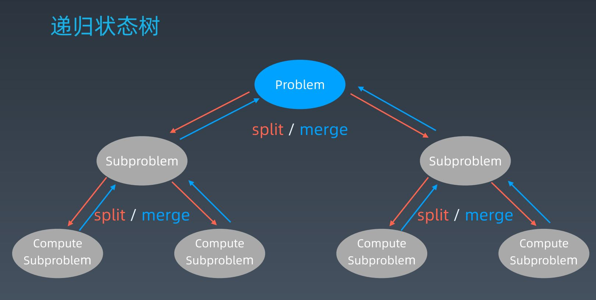

学习笔记

# 动态规划

动态规划的知识点不是单独分割开的，而是通常和分治，回溯，递归结合在一起解题。

### 往期知识点回顾

分治，回溯，递归并没有本质上的区别，其本质都是通过将原问题分解成结构相似的子问题，寻找问题的重复性，只不过在代码的细节处理上有所不同，因此三者的代码模板有共同点，都使用递归来解题。广义上来说，分治和回溯是递归的一种特殊类型问题。

**递归的代码模板**

```java
//通常递归函数的参数主要是：递归层次标记 + 层次需要传递的参数
public void recur(int level, int param) {
    //terminator：终止条件
    if(level > MAX_LEVEL) 
        //process result
        return;
    
    //process current logic
    process(level, param);
    
    //drill down：递归到下一层
    recur(level + 1, newParam);
    
    //根据需要恢复当前层状态
}
```

**分治代码模板**

分治将大问题分成子问题，子问题又分成更小的子问题。然后分别对不能再分的最小子问题解答，将结果聚合成上一层的子问题，依次类推，最终得到原问题的解。



```java
//分治的参数主要是：原问题，参数
public void divide(problem, params) {
    //终止条件。问题不能再分
    if(problem is min) {
        print(result);
        return
    }
    
    //分解问题
    subproblems[] = split(problems, condition);
    
    //对每个子问题递归到下一层
    result1 = divide(subproblems[0], params);
    result2 = divide(subproblems[1], params);
    ...;
    
    //合并问题的解
    result = merge(result1, result2, ...);
    
    //根据需要恢复当前层状态
}
```

需要谨记以下几点：

+ 人肉递归低效，容易出错，难以记住大量的递归层信息
+ 关键点：找到问题的重复性，将问题拆分，找到最简子问题，使用循环，条件分支，递归来解决
+ 数学归纳法思维：充分利用数学归纳法的递推思维来解决问题的重复性问题，拒绝人肉递归

以上问题的本质：**寻找问题的重复性**。当然有时候数学归纳法不是一下子就能想出来的，我们可以先画出问题的递归状态树，通过树中的重复分支寻找问题的重复性。结合剪枝等方法，最终找到递推方程，利用问题的重复性解决问题。

### 动态规划

什么是动态规划呢？根据wiki百科上的定义，其本质上是：**分治+最优子结构**
$$
将复杂的原问题分解成简单的子问题(用递归的方式)
$$
也就是说，动态规划本质上还是递归，只不过能够使用动态规划解决的问题需要具备一定的特性：**问题具有最优子结构**

最优子结构是指：每个子问题具有最优解，使用各子问题的最优解可以求出全部问题的最优解。也就是说每一步得到的都是最优的状态，那么我们就需要在判断当前最优状态时，可以得到之前每一步的最优解，从中选择保存最优的状态，这就需要我们使用 **缓存**。通过缓存之前每一步的最优解，我们避免了很多重复的运算，从而减小了时间复杂度

动态规划的关键点如下：

+ 动态规划和递归/分治没有根本上的区别，关键是看有无 **最优子结构**
+ 三者共性：找到重复子问题
+ 差异性：动态规划问题具有最优子结构，通过缓存中途可以淘汰次优解，保留最优解

