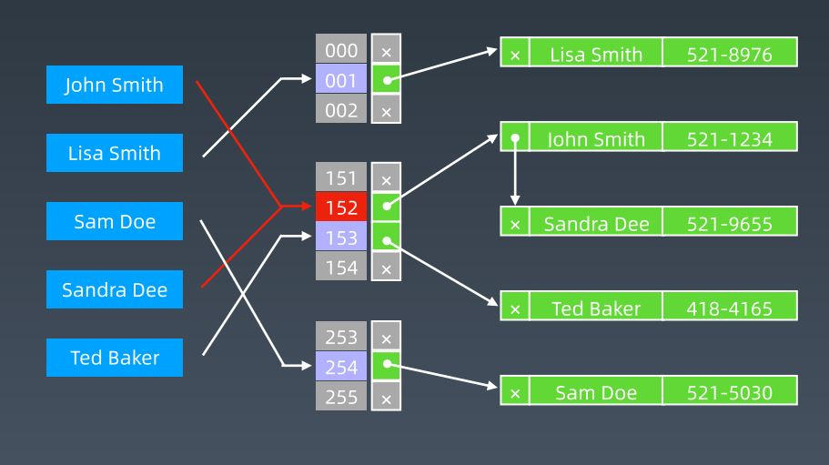
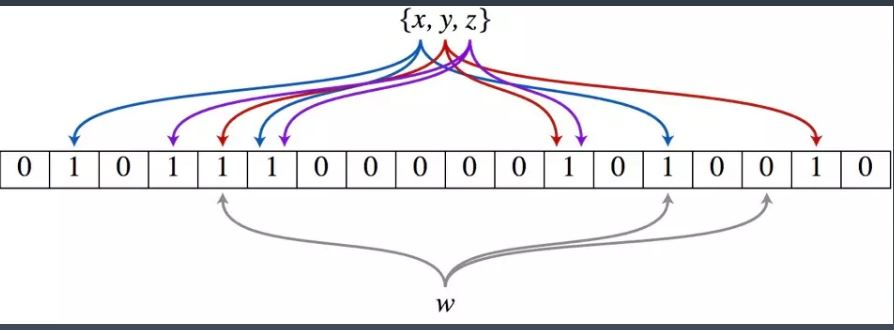
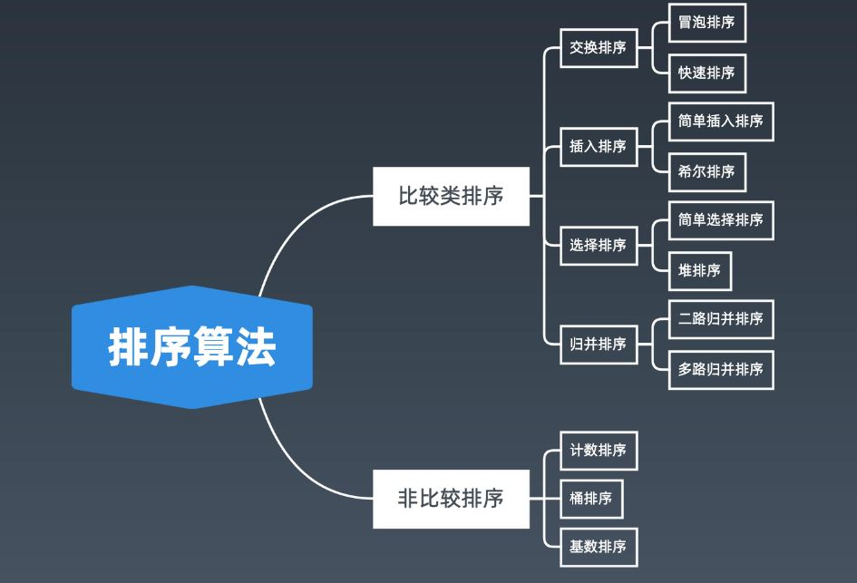
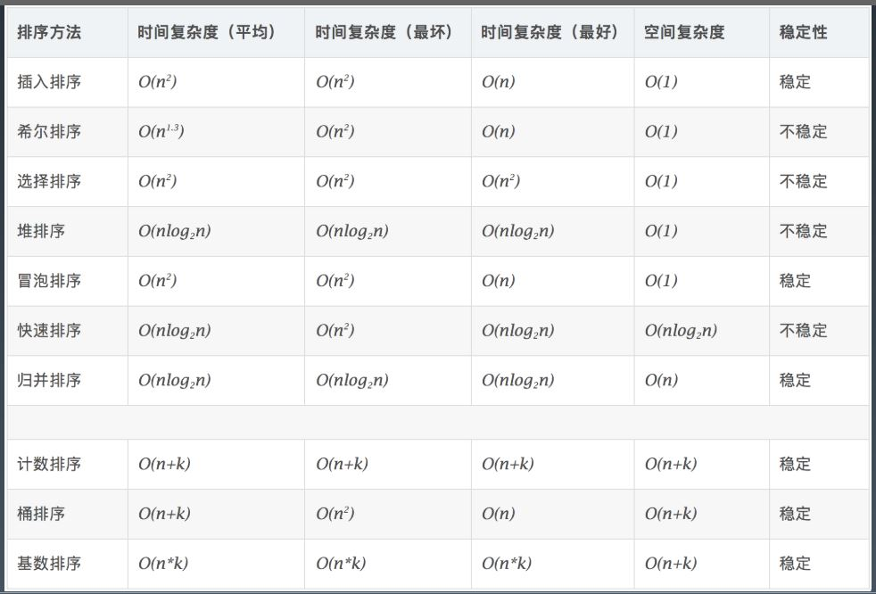

学习笔记

### 位运算

在计算机的世界中，所有的数据的表现形式和存储方式都是二进制，也就是所谓的01串，而在人类世世界中，数字的表现形式是10进制。

**位运算符**

| 含义                       | 运算符 | 示例                |
| -------------------------- | ------ | ------------------- |
| 左移                       | <<     | 0011 => 0110        |
| 右移                       | >>     | 0110 => 0011        |
| 按位或                     | \|     | 0011 \| 1011 = 1011 |
| 按位与                     | &      | 0011 & 1011 = 0011  |
| 按位取反                   | ~      | ~0011 = 1100        |
| 按位异或（相同为0不同为1） | ^      | 0011 ^ 1011 = 1000  |

**异或的一些特殊用法**

在异或中，其位运算规则为：**相同为0，不同为1**。其运算性质具有一些特殊操作。（异或具有结合性）

+ x ^ 0 = x
+ x ^ 1s(全1) = ~x
+ x ^ (~x) = 1s
+ x ^ x = 0
+ c = a ^ b , a ^ c = b, b ^ c = a (交换两个数)

**指定位置的位运算操作**

1. 将x最右边的n位清零：x & (~0 << n)

2. 获取x的第n位值（0或1）：(x >> n) & 1
3. 获取x的第n位的幂值：x & (1 << n)
4. 仅将x第n位置为1：x | (1 << n)
5. 仅将x第n位置为0：x & (~(1 << n))
6. 将x最高位至第n位清零：x & ((1 << n) - 1)

**实战位运算要点**

1. 判断奇偶
   + x % 2 == 1 -> (x & 1) == 1
   + x % 2 == 0 -> (x & 1) == 0
2. x >> 1 -> x / 2
3. x = x & ( x - 1 ) ：清零最低位的1
4. x & -x ：得到最低位的1
5. x & ~x = 0

### 布隆过滤器

布隆过滤器最典型的应用是用来判断 **一个元素是否存在于集合中** ？在了解布隆过滤器是什么前，我们需要知道一些前置知识。

**java的hashmap**

在java的hashmap中，实现hashmap的数据结构需要 哈希函数 + 存储数组 + 拉链表解决冲突。

如下图所示，使用哈希函数将待存放元素经过函数映射为存储数组中的特定下标，并将该元素存储至该下标位置。若存在两个不同的元素映射成了相同的数组下标，使用链表将元素链接起来解决冲突。



但是在很多实际应用场景中，我们并不需要实际存储元素，而只是想要判断元素是否逻辑存在于该集合中。这时候我们就需要布隆过滤器，布隆过滤器实际上相当于一个hashmap，只不过它不存储实际的元素，而只是用来标识该元素是否逻辑存在于集合中。

**布隆过滤器实现**

核心实现：超大位二进制数组 + 一系列随机哈希函数。

如下图，假设数组长度为m, 哈希函数个数为k



**添加元素过程**

假设对于新元素x，布隆过滤器实现如下步骤将其逻辑添加至集合中：

+ 对元素x实现k次哈希函数映射计算，得到k个数组下标
+ 将k个数组下标全部置1

**查询元素过程**

假设对于新元素w，布隆过滤器实现如下步骤查询其是否逻辑存在于集合中：

+ 对元素w进行k次哈希函数映射计算，得到k个数组下标
+ 若有任意一个位置为0，元素一定不在集合中
+ 若全部位置为0，元素可能存在集合中

从以上信息可以看到，布隆过滤器添加元素时并不实际存储元素本身，而是使用二进制标志位标识元素逻辑添加至集合中；在判断元素是否存在于集合中时，若全部哈希位数都为1，我们并不能完全确定元素一定在集合中，因为会存在偶然性，但是若一个为0则元素一定不在集合中，所以，布隆过滤器具有如下特点：

+ 空间效率和查询时间远远超过一般的算法
+ 存在一定的误判率和删除困难

**布隆过滤器实现**

```java
import java.util.BitSet;
import java.util.Random;
import java.util.Iterator;

public class BloomFilter implements Cloneable {
    private BitSet hashes; //二进制位数组
    private RandomInRange prng;
    private int k;//哈希函数个数
    private static final double LN2 = 0.6931471805599453; //ln(2)
    
    /**
    * create a new bloom filter
    * @param n expected number of elements, 
    * @param m desired size of the container in bits
    **/
    
    public BloomFilter(int n, int m) {
        k = (int) Math.round(LN2 * m / n);
        if (k <= 0) k = 1;
        this.hashes = new BitSet(m);
        this.prng = new RandomInRange(m, k);      
    }
    
    /**
    * create a bloom filter of 1Mb
    * @param n expected number of elements
    **/
    public BloomFilter(int n) {
        this(n, 1024*1024*8);
    }
    
    //add an element to the container
    public void add(Object o) {
        prng.init(o); //得到对象o的哈希映射值
        for(RandomInRange r : prng) {
            hashes.set(r.value);
        }
    }
    
    //whether or not the element is in the container
    public boolean contains(Object o) {
        prng.init(o);
        for (RandomInRange r : prng) {
            if (!hashes.get(r.value))
                return false;
        }
        return true; //对象可能在容器中
    }
    
    //remove all of the elements from this filter
    public void clear() {
        hashes.clear();
    }
    
    //create a copy of the current filter
    public BloomFilter clone() throws CloneNotSupportedException {
        return (BloomFilter) super.clone();
    }
    
    //generate a unique hash representing the filter
    public int hashCode() {
        return hashes.hashCode() ^ k;
    }
    
    //test if the filters have equal bitsets
    //two filters may contain the same elements, but not be equal. if they have different size for example
    
    public boolean equals(BloomFilter other) {
        return this.hashes.equals(other.hashes) && this.k == other.k;
    }
    
    //merge another bloom filter into the current one
    public void merge(BloomFilter other) {
        if (other.k != this.k || other.hashes.size() != this.hashes.size()) {
            throw new IllegalArgumentException("Incompatible bloom filters");
        }
        
        this.hashes.or(other.hashes);
    }
    
    //将哈希函数私有化
    private class RandomInRange implements Iterable<RandomInRange>, Iterator<RandomInRange> {
        private Random prng;
        private int max; //maximum value returned + 1
        private int count; //number of random elements to generate
        private int i = 0; //number of elements generated
        public int value; //the current value
        
        RandomInRange(int maximum, int k) {
            max = maximum;
            count = k;
            prng = new Random();
        }
        public void init(Object o) {
            prng.setSeed(o.hashCode());
        }
        
        public Iterator<RandomInRange> iterator() {
            i = 0;
            return this;
        }
        
        public RandomInRange next() {
            i++;
            value = prng.nextInt() % max;
            if(value < 0) value = -value;
            return this;
        }
        
        public boolean hashNext() {
            return i < count;
        }
        
        public void remove() {
            throw new UnsupportedOperationException();
        }
    }
}
```

### LRU Cache

LRU (least recently used)，最近最少使用，一种缓存的替换算法。缓存通常用来进行加快查找的速度，通过算法策略将将来大概率会使用到的内容提前放置到缓存中，提高命中率和查找率。

缓存的大小是有限的，当目前的缓存区域满了后，对于新来的元素我们需要考虑淘汰缓存中旧元素，将新元素放入。

在LRU淘汰策略中，其实现的数据结构为哈希表 + 双向链表，其查找，修改，更新等操作时间复杂度都为O(1)

**LRU实现**

```c++
//双向链表结点
struct CacheNode {
    int key, value;
    CacheNode *pre, *next;
    
    CacheNode(int k = 0, int v = 0) 
        : key(k), value(v), pre(NULL), next(NULL) {}
};

//使用最频繁的元素放到链表末尾，最少的放到链表开头
class LRUCache {
public:
    LRUCache(int capacity) {
        this.capacity = capacity;
        this.head = new CacheNode();
        this.tail = this.head;
    }
    
    int get(int key) {
        //判断元素是否在缓存中
        auto it = cache.find(key);
        if(it == cache.end())
            return -1;
        //找到元素并使用，移动结点
        moveToTail(it->second);
        return it->second->value;
    }
    
    int put(int key, int value) {
        auto it = cache.find(key);
        //找到元素，更新其值
        if(it != cache.end()){
            it->second->value = value;
            moveToTail(it->second);
        }
        //缓存容量够
        else if((int)cache.size() < capacity) {
            auto node = new CacheNode(key, value);
            addToTail(node);
            cache[key] = node;
        }
        else{
            //容量不够，进行淘汰策略
            cache.erase(head->next->key);
            moveToTail(head->next);
            tail->key = key;
            tail->value = value;
            cache[key] = tail;
        }
    }
    
    //释放结点
    ~LRUCache() {
        auto pCurr = head;
        while(pCurr != NULL) {
            auto next = pCurr->next;
            delete pCurr;
            pCurr = next;
        }
    }
    
private:
    const int capacity; //缓存容量
    CacheNode *const head, *tail; //链表头尾结点
    unordered_map<int, CacheNode*> cache; 
    
    //将结点移动到尾部
    void moveToTail(CacheNode *node) {
        if(node == tail)
            return ;
        node->pre->next = node->next;
        node->next->pre = node->pre;
        
        addToTail(node);
    }
    
    void addToTail(CacheNode *node) {
        node->next = tail->next;
        tail->next = node;
        node->pre = tail;
        tail = node;
    }
};
```

```java
//频繁结点在头部，少使用在尾部
class LRUCache {
    //双向链表结点
    private static class DLinkNode {
        Integer key;
        Integer value;
        DLinkNode prev;
        DLinkNode next;
        
        DLinkNode() {
            
        }
        
        DLinkNode(Integer key, Integer value) {
            this.key = key;
            this.value = value;
        }
    }
    //缓存映射表
    private Map<Integer, DLinkNode> cache = new HashMap<>();
    
    private int size; //缓存大小
    private int capacity; //缓存容量
    
    private DLinkNode head, tail; //头尾结点
    
    public LRUCache(int capacity) {
        this.size = 0;
        this.capacity = capacity;
        head = new DLinkNode();
        tail = new DLinkNode();
        head.next = tail;
        tail.pre = head;
    }
    
    //获取结点
    public int get(int key) {
        DLinkNode node = cache.get(key);
        if(node == null)
            return -1;
        //移动到链表头部
        moveToHead(node);
        return node.value;
    }
    
    //添加结点
    public void put(int key, int value) {
        DLinkNode node = cache.get(key);
        //是否存在该结点
        if(node == null) {
            DLinkNode newNode = new DLinkNode(key, value);
            cache.put(key, newNode);
            //添加到链表头部
            addToHead(newNode);
            size++;
            
            //判断缓存容量
            if(size > capacity) {
                //淘汰结点
                DLinkNode tail = removeTail();
                cache.remove(tail.key);
                size--;
            }
        } else {
            node.value = value;
            //移动到链表头部
            moveToHead(node);
        }
    }
    
    //删除尾结点并返回删除的结点
    private DLinkNode removeTail() {
        DLinkNode node = tail.prev();
        removeNode(node);
        return node;
    }
    
    private void removeNode(DLinkNode node) {
        node.next.prev = node.prev;
        node.prev.next = node.next;
    }
    
    //添加结点到链表头部
    private void addToHead(DLinkNode node) {
        node.prev = head;
        node.next = head.next;
        head.next.prev = node;
        head.next = node;
    }
    
    //移动结点到链表头部
    private void moveToHead(DLinkNode node) {
        removeNode(node); //先将结点从原位置删除
        addToHead(node); //将结点添加至头部
    }
}
```

### 排序

排序算法主要分为两类：

+ 比较类排序：通过比较来决定元素间的相对次序，由于其时间复杂度不能突破O(nlogn)，因此也成为非线性时间比较类排序
+ 非比较类排序：不通过比较来决定元素间的相对次序，它可以突破基于比较排序的时间下界，以线性时间来运行，因此也称为线性时间非比较类排序

如下图所示，排序算法分类：



各个排序算法的时间复杂度如下所示：



面试常考排序算法如下：

**初级排序**

1. 选择排序：首先在初始序列中找到最小（大）元素，存放到排序序列的起始位置，再从剩余未排序元素中继续寻找最小（大）元素，放到已排序元素的末尾。以此类推，直到所有元素均排序完成
2. 插入排序：从前往后逐步构建有序序列，对于未排序数据，在已经排好序的序列中从后向前扫描，找到相应位置并插入
3. 冒泡排序：嵌套两层循环，每次查看相邻元素是否逆序，逆序则交换

**高级排序**

归并和快速排序具有相似性，两者时间复杂度都为O(nlogn)。但是其排序步骤相反：

+ 归并：先排序左右子数组，再合并两个有序子数组
+ 快排：先分配出左右子数组，再分别对左右子数组排序

1. 快速排序：在数组中随机选取枢轴pivot，将比pivot小的元素放到左边，比pivot大的元素放到右边，然后依次对pivot左边和右边的子数组继续重复该步骤，达到整个序列有序。快速排序采用了分治的思想

   ```java
   private int partition(int[] a, int low, int high) {
       int pivot = a[low];
       while(low < high) {
           while(low < high && a[high] >= pivot)
               high--;
           if(low < high){
               a[low] = a[high];
               low++;
           }
           while(low < high && a[low] <= pivot)
               low++;
           if(low < high){
               a[high] = a[low];
               high--;
           }
       }
       a[low] = pivot;
       return low;
   }
   
   public static void quickSort(int[] array, int low, int high) {
       if(high <= low)
           return;
       int mid = partition(array, low, high);
       quickSort(array, low, mid - 1);
       quickSort(array, mid + 1, high);
   }
   ```

   

2. 归并排序：基于分治的思想。

   + 把长度为n的初始序列分成两个长度为n/2的子序列
   + 对这两个子序列分别采用归并排序
   + 将两个排好序的子序列合并成一个最终有序的序列

   ```java
   public static void mergeSort(int[] array, int left, int right) {
       if(right <= left)
           return;
       int mid = left + (right - left) / 2;
       mergeSort(array, left, mid);
       mergeSort(array, mid + 1, right);
       merge(array, left, mid, right);
   }
   
   private void merge(int[] array, int left, int mid, int right) {
       int[] tmp = new int[right - left + 1];
       int i = left, j = mid + 1, k = 0;
       
       while(i <= mid && j <= right) {
           tmp[k++] = array[i] < array[j] ? array[i++] : array[j++];
           
       }
       
       while(i <= mid)
           tmp[k++] = array[i++];
       while(j <= right)
           tmp[k++] = array[j++];
       
       for(int i = 0; i < tmp.length; i++) 
       	array[i] = tmp[i];
   }
   ```

3. 堆排序：使用堆的性质来加快取最大（最小）值的时间，取小顶堆为例子

   + 初始序列建立小顶堆
   + 依次取堆顶元素，然后进行一次元素和堆调整

   小顶堆用来排序降序序列，大顶堆用来排序升序序列

   ```java
   
   public static buildMaxHeap(int[] arr) {
       int len = arr.length;
       //使用初始序列建立大顶堆
       for(int i = len >> 2; i >= 0; i++)
           heapify(arr, i);
   }
   
   //堆调整
   private void heapify(int[] arr, int idx, int len) {
       //左孩子
       int left = 2 * idx + 1;
       //右孩子
       int right = 2 * idx + 2;
       int max = idx;
       
       if(left < len && arr[left] > arr[max])
           max = left;
       if(right < len && arr[right] > arr[max])
           max = right;
       if(max != idx){
           swap(arr, idx, max);
           heapify(arr, max);
       }
   }
   
   private void swap(int[] arr, int i, int j) {
       int tmp = arr[i];
       arr[i] = arr[j];
       arr[j] = tmp;
   }
   
   //堆排序
   public void heapSort(int[] arr) {
       buildMaxHeap(arr);
       //每次取堆顶元素
       for(int i = arr.length - 1; i > 0; i--) {
           swap(arr, 0, i);
           heapify(arr, 0, i);
       }
   }
   ```

**特殊排序 -- O(n)** 

1. 计数排序：计数排序要求输入的数据必须是有确定范围的整数。将输入的数据值转化为键存 储在额外开辟的数组空间中；然后依次把计数大于 1 的填充回原数组
2. 桶排序：假设输入数据服从均匀分布，将数据分到 有限数量的桶里，每个桶再分别排序（有可能再使用别的排序算法或是以递归方 式继续使用桶排序进行排）。
3. 基数排序：基数排序是按照低位先排序，然后收集；再按照高位排序，然后再收集；依次类 推，直到最高位。有时候有些属性是有优先级顺序的，先按低优先级排序，再按 高优先级排序。